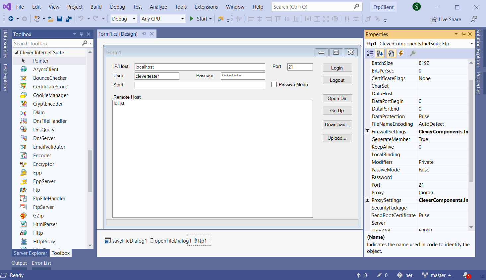

# FTP Client

  
The example represents a Delphi FTP client, which can log in to an FTP server, browse remote directories, download remote files, and upload local files to a selected FTP directory.   

The [GitHub/CleverComponents/Clever-Internet-Suite-Tutorials](https://github.com/CleverComponents/Clever-Internet-Suite-Tutorials) repository represents a list of examples, code snippets and demo projects for the [Clever Internet Suite Tutorials](https://www.clevercomponents.com/articles/article035/) article. This list will be periodically updated, new projects will be added.   
Please stay tuned to new examples and use cases of the [Clever Internet Suite](https://www.clevercomponents.com/products/inetsuite/) library.

**How to compile and run** - see [Lib/ReadMe](./Lib/ReadMe.md)   
