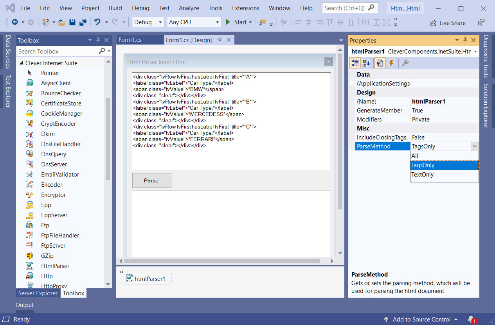

# Parse inner HTML in .NET

The HtmlParseInnerHtml project represents a code example for the [Parse inner HTML](https://www.clevercomponents.com/portal/kb/a76/parse-inner-html.aspx) tutorial.   

The sample runs the TclHtmlParser component and extracts inner HTML from specific tags.   

The [GitHub/CleverComponents/Clever-Internet-Suite-Tutorials](https://github.com/CleverComponents/Clever-Internet-Suite-Tutorials) repository represents a list of examples, code snippets and demo projects for the [Clever Internet Suite Tutorials](https://www.clevercomponents.com/articles/article035/) article. This list will be periodically updated, new projects will be added.   
Please stay tuned to new examples and use cases of the [Clever Internet Suite](https://www.clevercomponents.com/products/inetsuite/) library.

**How to compile and run** - see [Lib/ReadMe](./Lib/ReadMe.md)   
