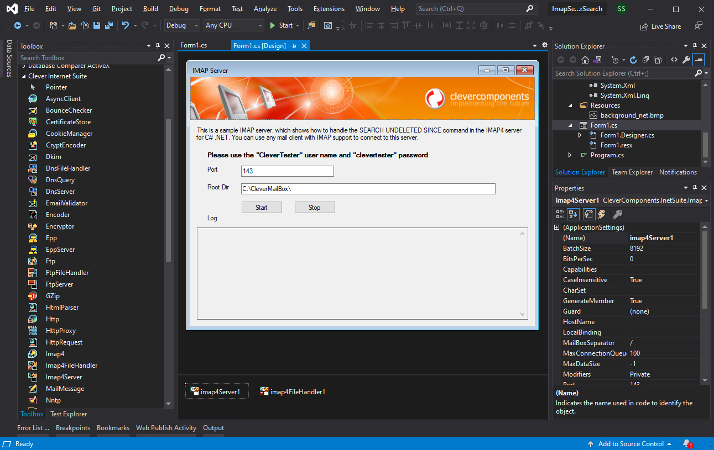
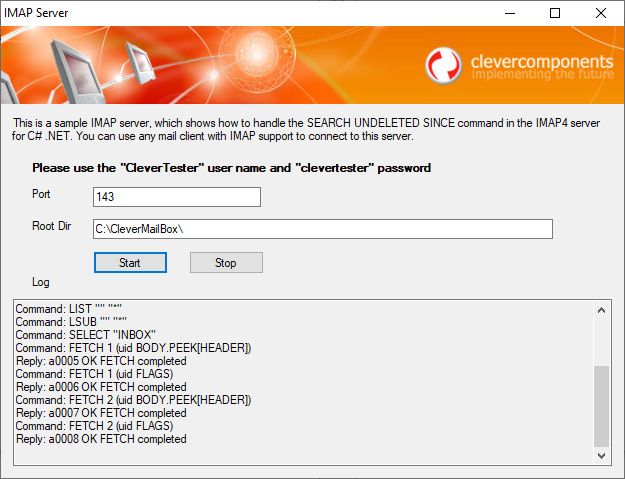

# Handling SEARCH UNDELETED SINCE in IMAP4 Server for C# .NET

The ImapServerSearch project represents a code example for the [Handling SEARCH UNDELETED SINCE in IMAP4 Server for C# .NET](https://www.clevercomponents.com/portal/kb/a177/handling-search-undeleted-since-in-imap4-server-for-c-_net.aspx) tutorial.   

This is a sample IMAP server, which shows how to handle the SEARCH UNDELETED SINCE command in IMAP4 Server for C# .NET.   
You can use any mail client with IMAP support to connect to this server.   

See also:   
[IMAP4 Server with TLS/SSL support](https://github.com/CleverComponents/Clever-Internet-Suite-Examples/tree/master/CS/ImapServerSSL)   

The [GitHub/CleverComponents/Clever-Internet-Suite-Tutorials](https://github.com/CleverComponents/Clever-Internet-Suite-Tutorials) repository represents a list of examples, code snippets and demo projects for the [Clever Internet Suite Tutorials](https://www.clevercomponents.com/articles/article035/) article. This list will be periodically updated, new projects will be added.   
Please stay tuned to new examples and use cases of the [Clever Internet Suite](https://www.clevercomponents.com/products/inetsuite/) library.

Join us on  [Facebook](https://www.facebook.com/clevercomponents)  [YouTube](https://www.youtube.com/channel/UC9Si4WNQVSeXQMjdEJ8j1fg)  [Twitter](https://twitter.com/CleverComponent)  [Telegram](https://t.me/clevercomponents)  [Newsletter](https://www.clevercomponents.com/home/maillist.asp)   

---

🔔 New integration examples are published regularly.
Subscribe: https://www.clevercomponents.com/home/maillist.asp

---
