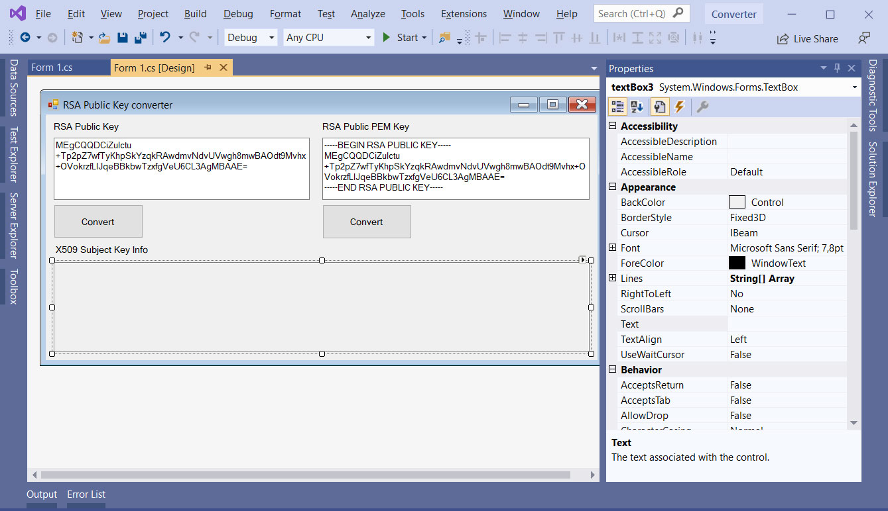

# Convert RSA Public Key format to X509 Subject Key Info format in .NET

The PemConverter project represents a code example for the [Convert RSA Public Key format to X509 Subject Key Info format](https://www.clevercomponents.com/portal/kb/a138/convert-rsa-public-key-format-to-x509-subject-key-info-format.aspx) tutorial.   

There are two simple functions that convert RSA Public Key format to X509 Subject Key Info format in base64 and PEM representation.   

The [GitHub/CleverComponents/Clever-Internet-Suite-Tutorials](https://github.com/CleverComponents/Clever-Internet-Suite-Tutorials) repository represents a list of examples, code snippets and demo projects for the [Clever Internet Suite Tutorials](https://www.clevercomponents.com/articles/article035/) article. This list will be periodically updated, new projects will be added.   
Please stay tuned to new examples and use cases of the [Clever Internet Suite](https://www.clevercomponents.com/products/inetsuite/) library.

**How to compile and run** - see [Lib/ReadMe](./Lib/ReadMe.md)   

---

🔔 New integration examples are published regularly.
Subscribe: https://www.clevercomponents.com/home/maillist.asp

---
