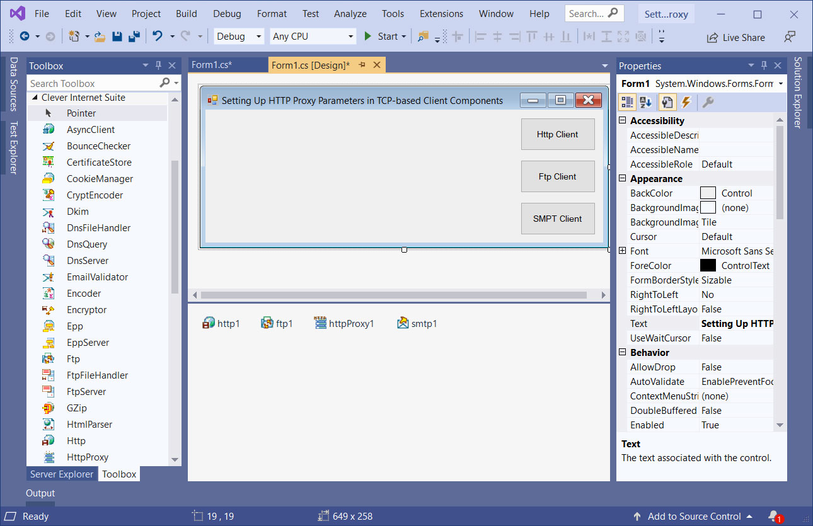

# Setting Up HTTP Proxy Parameters in TCP-based Client Components in .NET

The SettingUpHttpProxy project represents a code example for the [Setting Up HTTP Proxy Parameters in TCP-based Client Components](https://www.clevercomponents.com/portal/kb/a21/setting-up-http-proxy-parameters-in-tcp-based-client-components.aspx) tutorial.   

All these components provide two special properties for both HTTP and FTP hosts: HttpProxySettings and FtpProxySettings, correspondingly.   

The [GitHub/CleverComponents/Clever-Internet-Suite-Tutorials](https://github.com/CleverComponents/Clever-Internet-Suite-Tutorials) repository represents a list of examples, code snippets and demo projects for the [Clever Internet Suite Tutorials](https://www.clevercomponents.com/articles/article035/) article. This list will be periodically updated, new projects will be added.   
Please stay tuned to new examples and use cases of the [Clever Internet Suite](https://www.clevercomponents.com/products/inetsuite/) library.

**How to compile and run** - see [Lib/ReadMe](./Lib/ReadMe.md)   
