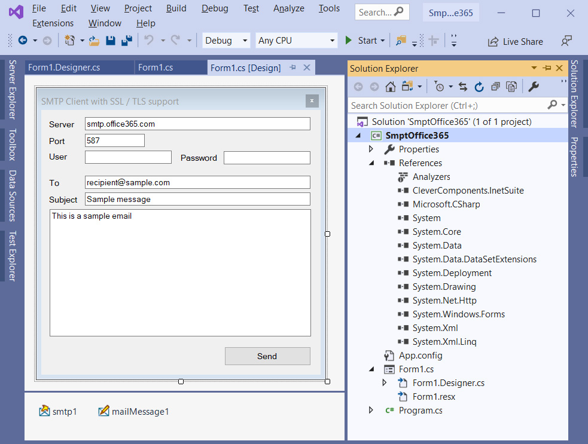

# Send SMTP email with Office365 account in .NET

The SmtpOffice365 project represents a code example for the [Send SMTP email with Office365 account](https://www.clevercomponents.com/portal/kb/a143/send-smtp-email-with-office365-account.aspx) tutorial.   

This sample connects to the smtp.office365.com host via the STARTTLS command, composes a sample mail message and sends it.   

The [GitHub/CleverComponents/Clever-Internet-Suite-Tutorials](https://github.com/CleverComponents/Clever-Internet-Suite-Tutorials) repository represents a list of examples, code snippets and demo projects for the [Clever Internet Suite Tutorials](https://www.clevercomponents.com/articles/article035/) article. This list will be periodically updated, new projects will be added.   
Please stay tuned to new examples and use cases of the [Clever Internet Suite](https://www.clevercomponents.com/products/inetsuite/) library.

**How to compile and run** - see [Lib/ReadMe](./Lib/ReadMe.md)   
