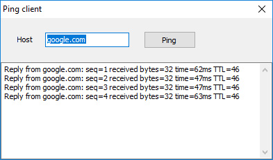

# ICMP Ping Client

The PingClient project is a code example for the [Ping client](https://www.clevercomponents.com/portal/kb/a75/ping-client.aspx) tutorial.

This project demonstrates how to implement a simple ICMP Ping client using the Clever Internet Suite library. It shows how to send ICMP Echo Request packets and receive responses to measure network connectivity and latency. The example requires administrator privileges to run on modern Windows systems and demonstrates low-level binary packet manipulation.

## Overview

This Delphi application provides a simple GUI tool that allows users to ping network hosts and display response statistics. The example demonstrates:
- Creating and sending ICMP Echo Request packets
- Receiving and parsing ICMP Echo Reply packets
- Measuring round-trip time (RTT) for network packets
- Displaying detailed response information including sequence numbers and TTL values
- Working with binary structures of ICMP and IP packets

## Features

- **ICMP Protocol Implementation**: Demonstrates low-level ICMP packet construction and parsing
- **Network Diagnostics**: Provides basic ping functionality for network troubleshooting
- **Detailed Response Information**: Shows sequence numbers, packet sizes, round-trip times, and TTL values
- **Simple User Interface**: Clean interface for entering hostnames and viewing results
- **Multiple Ping Attempts**: Automatically sends 4 consecutive ping requests
- **Error Handling**: Gracefully handles timeouts and network errors

## Usage

1. **Launch the application** - You'll see a simple form with a host input field
2. **Enter target host** - Type a hostname or IP address (e.g., "google.com" or "8.8.8.8")
3. **Click Ping** - Press the Ping button to initiate the ping sequence
4. **View results** - The memo area displays responses from each ping attempt, including:
   - Reply source address
   - Sequence number
   - Received bytes count
   - Round-trip time in milliseconds
   - Time-To-Live (TTL) value

**Note**: This application requires administrator privileges to run on modern Windows versions due to its use of raw sockets for ICMP packet manipulation.

## Application Scenarios

- **Network Troubleshooting**: Quickly check connectivity to remote hosts
- **Latency Measurement**: Measure round-trip times for network optimization
- **Service Monitoring**: Verify availability of network services
- **Educational Purposes**: Understanding ICMP protocol and raw socket programming
- **Development Testing**: Network diagnostics during application development

## Requirements

- **Delphi Version**: Delphi 7 or higher
- **Clever Internet Suite**: Version 10.0 or higher
- **Administrator Privileges**: Required on modern Windows systems for raw socket operations
- **Network Access**: Appropriate network permissions and firewall settings
- **Note**: The project was compiled with Clever Internet Suite version 12. Tutorials and project files for previous versions can be found in the [Releases](https://github.com/CleverComponents/Clever-Internet-Suite-Tutorials/releases) section.

## Technical Notes

- **Raw Socket Operations**: Uses `SOCK_RAW` socket type with `IPPROTO_ICMP` protocol
- **Binary Packet Manipulation**: Demonstrates direct construction and parsing of ICMP and IP packet headers
- **Checksum Calculation**: Implements ICMP packet checksum calculation
- **Time Measurement**: Uses `GetTickCount` for precise round-trip time measurement

## Compilation Instructions

This project uses raw sockets for ICMP operations. Ensure your Delphi environment has appropriate permissions and network access configured. The application must be run with administrator privileges to function correctly.

## Repository

The [GitHub/CleverComponents/Clever-Internet-Suite-Tutorials](https://github.com/CleverComponents/Clever-Internet-Suite-Tutorials) repository contains a collection of examples, code snippets, and demo projects for the [Clever Internet Suite Tutorials](https://www.clevercomponents.com/articles/article035/). It will be updated periodically with new projects.

Stay tuned for new examples and use cases of the [Clever Internet Suite](https://www.clevercomponents.com/products/inetsuite/) library.