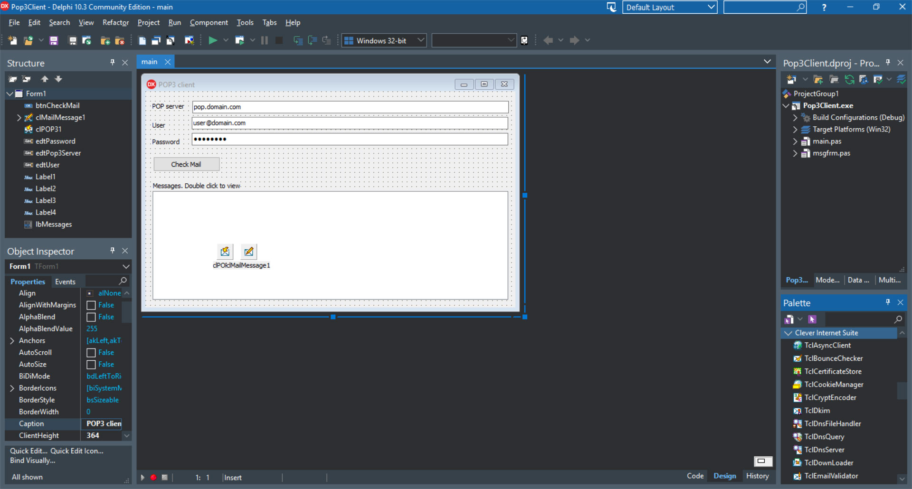

# POP3 Client

The POP3 Client project represents a code example for the [POP3 Client](https://www.clevercomponents.com/portal/kb/a136/sftp-client-with-user-and-public-key-authorization.aspx) tutorial.   

The example represents a simple POP3 client, which can connect to a POP3 server, list available Emails within a mailbox, and download the selected message content. The program extracts MIME message parts, including text, HTML, and headers.   

The [GitHub/CleverComponents/Clever-Internet-Suite-Tutorials](https://github.com/CleverComponents/Clever-Internet-Suite-Tutorials) repository represents a list of examples, code snippets and demo projects for the [Clever Internet Suite Tutorials](https://www.clevercomponents.com/articles/article035/) article. This list will be periodically updated, new projects will be added.   
Please stay tuned to new examples and use cases of the [Clever Internet Suite](https://www.clevercomponents.com/products/inetsuite/) library.
