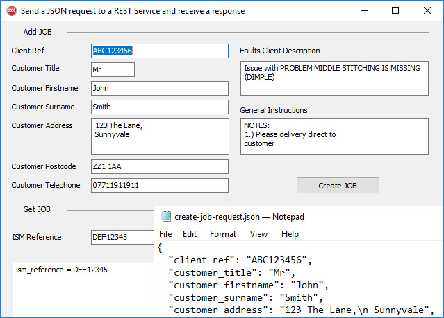

# How to write a REST client with JSON in Delphi

The RestClientSendReceiveJson project represents a code example for the [How to write a REST client with JSON in Delphi](https://www.clevercomponents.com/portal/kb/a135/how-to-write-a-rest-client-with-json-in-delphi.aspx) tutorial.   

This tutorial represents a Delphi REST API Client with JSON. It makes a JSON request, which includes objects and object properties, sends this request to a Web service, and receives a JSON response. The example parses a received JSON response and extracts all included object properties.   

The sources for both the clJsonSerializerBase and the clJsonSerializer units are free and can be downloaded from our GitHub repository:
https://github.com/CleverComponents/Json-Serializer

Also, please check out the following article, which describes how to use the JSON serialization classes in your code:
https://www.clevercomponents.com/articles/article040/

Clever Internet Suite downloads:
https://www.clevercomponents.com/downloads/inetsuite/suitedownload.asp

See also:   
[How to send a GET request with JSON data](https://www.clevercomponents.com/portal/kb/a125/how-to-send-a-get-request-with-json-data.aspx)   
[How to Post JSON data](https://www.clevercomponents.com/portal/kb/a78/how-to-post-json-data.aspx)   
[How to make a PUT HTTP request with JSON data](https://www.clevercomponents.com/portal/kb/a110/how-to-make-the-put-http-request-with-json-data.aspx)   

The [GitHub/CleverComponents/Clever-Internet-Suite-Tutorials](https://github.com/CleverComponents/Clever-Internet-Suite-Tutorials) repository represents a list of examples, code snippets and demo projects for the [Clever Internet Suite Tutorials](https://www.clevercomponents.com/articles/article035/) article. This list will be periodically updated, new projects will be added.   
Please stay tuned to new examples and use cases of the [Clever Internet Suite](https://www.clevercomponents.com/products/inetsuite/) library.
