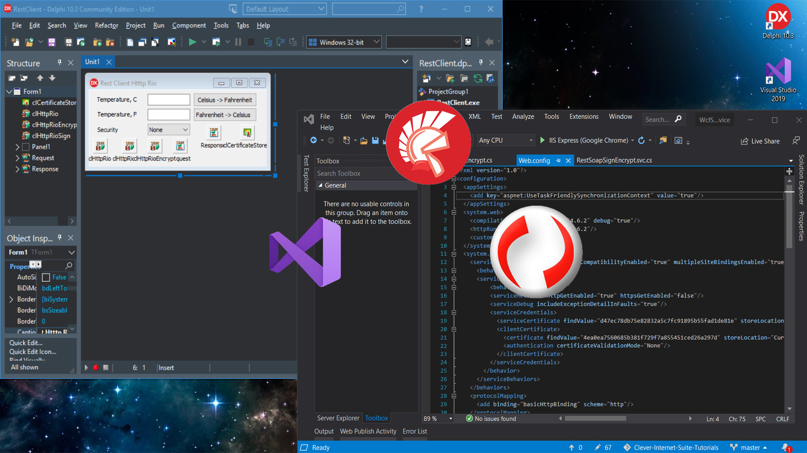

# Delphi REST SOAP Client with WSS Signatures and Encryption

This tutorial shows how to make a remote procedure call to a REST service with WS-Security data protection and x509 digital signatures. The given example connects to a REST sercvice, which is written using C# WCF. The service implements a simple algorithm, which converts Celsius to Fahrenheit, and vice versa. Both SOAP requests and responses are digitally signed and encrypted using x509 crypthographic keys. Delphi client utilizes the TclHttpRio component from the Clever Internet Suite library.[Delphi REST SOAP Client with WSS Signatures and Encryption](https://www.clevercomponents.com/portal/kb/a157/delphi-rest-soap-client-with-wss-signatures-and-encryption.aspx) 

The [GitHub/CleverComponents/Clever-Internet-Suite-Tutorials](https://github.com/CleverComponents/Clever-Internet-Suite-Tutorials) repository represents a list of examples, code snippets and demo projects for the [Clever Internet Suite Tutorials](https://www.clevercomponents.com/articles/article035/) article. This list will be periodically updated, new projects will be added.   
Please stay tuned to new examples and use cases of the [Clever Internet Suite](https://www.clevercomponents.com/products/inetsuite/) library.
