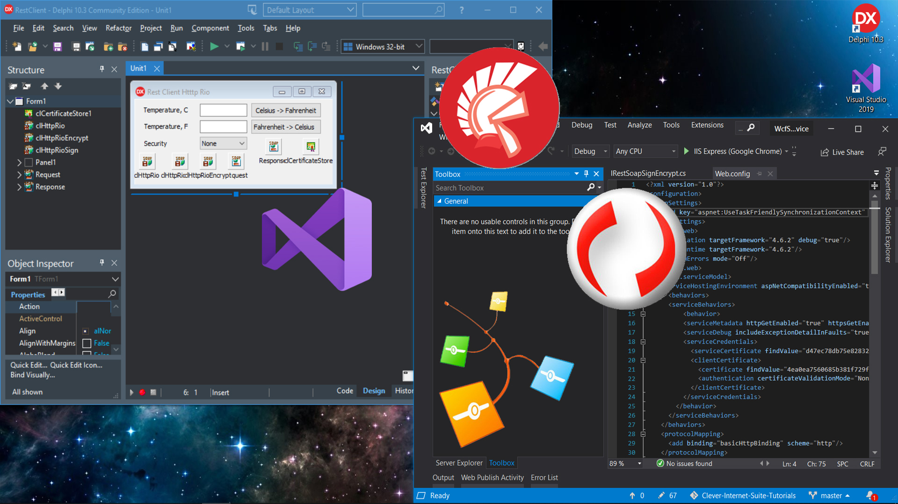

# Delphi REST SOAP Client with WS-Security Signatures and Encryption

This tutorial demonstrates a complete cross-platform example of secure SOAP over HTTP (often referred to as REST-style SOAP) communication with WS-Security protection. The solution consists of three parts: a **Delphi client application** built with Clever Internet Suite, a **C# WCF service** hosting three endpoints with varying security levels, and an **auxiliary C# WCF client** for service testing. The service implements a simple temperature conversion algorithm (Celsius to Fahrenheit and vice versa). Both SOAP requests and responses can be digitally signed and encrypted using x.509 cryptographic keys, showcasing enterprise-level security integration. The Delphi client utilizes the `TclHttpRio` component from the Clever Internet Suite library.

This is the official tutorial: [Delphi REST SOAP Client with WSS Signatures and Encryption](https://www.clevercomponents.com/portal/kb/a157/delphi-rest-soap-client-with-wss-signatures-and-encryption.aspx)  
You can also watch a video guide on [YouTube](https://youtu.be/YrvUzdfTpFA)

## Overview

This project provides a practical, hands-on example for Delphi developers needing to interact with secure modern web services. It demonstrates:

*   How to consume a WCF REST/SOAP service from a Delphi application using the `TclHttpRio` component.
*   Implementation of **WS-Security (WSS) standards** for message-level security.
*   Configuration of **x.509 digital signatures** to ensure message integrity and non-repudiation.
*   Configuration of **x.509 encryption** to ensure message confidentiality.
*   Handling of three distinct security policies: **None**, **Sign Only**, and **Sign & Encrypt**.
*   A complete, ready-to-host **C# WCF service backend** with matching security configuration.

## Features

*   **Cross-Platform Communication**: Delphi client seamlessly communicates with a .NET WCF service.
*   **Configurable Security**: The client offers a dropdown to select the security level, interacting with different service endpoints.
*   **Comprehensive Security Setup**:
    *   `TclSoapMessage` components pre-configured for signing and encryption.
    *   Event handlers for dynamic certificate retrieval (`OnGetSigningCertificate`, `OnGetEncryptionCertificate`).
    *   Uses `TclCertificateStore` to access Windows Certificate Store.
*   **Complete Service Reference**: Includes generated WSDL import units (`RestSoap.pas`, `RestSoapSign.pas`, `RestSoapSignEncrypt.pas`) for strong typing.
*   **Ready-to-Run Backend**: Includes the full C# WCF service project (`WcfService`) and a test client (`WcfClient`).

## Usage

To run this example, you need to set up both the server and the client.

### Prerequisites: Certificate Setup

The security relies on x.509 certificates being present in the Windows Certificate Store. **You must use your own certificates** for this to work.

1.  **Obtain or Create Certificates**: You need two x.509 certificates:
    *   One certificate for **signing messages** (requires private key).
    *   Another certificate for **encrypting messages** (requires private key for service; client needs public key).
    *   These can be obtained from a Certificate Authority (CA) or generated as self-signed certificates for testing.

2.  **Install Certificates**:
    *   Install both certificates (with their private keys) into the **Current User -> Personal (My) -> Certificates** store on the machine running the WCF service.
    *   **Important**: The client certificate (used for signing) must also be trusted by the server. For self-signed certificates, you may need to install them into the **Trusted People** store.

3.  **Configure Service and Client**: After installing your certificates, you must update configuration files with your specific certificate thumbprints:
    *   In the C# WCF service `Web.config` file:
        *   Update the `findValue` attribute in the `<serviceCertificate>` element with the thumbprint of your **encryption certificate**.
        *   Update the `findValue` attribute in the `<clientCertificate>/<certificate>` element with the thumbprint of your **signing certificate**.
    *   In the Delphi client code (`Unit1.pas`), update the thumbprint values in the event handlers:
        *   In `RequestGetSigningCertificate`, change `'c1e8b809...'` to your **signing certificate's thumbprint**.
        *   In `RequestGetEncryptionCertificate`, change `'d47ec78d...'` to your **encryption certificate's thumbprint**.

    **Finding Certificate Thumbprint**: You can view certificate thumbprints in Windows by opening the certificate details from the Certificate Store management console. Copy the thumbprint value (without spaces).

### Step 1: Configure and Run the C# WCF Service

1.  Open the `WcfService` project in Visual Studio (e.g., 2017/2019/2022).
2.  Update the `Web.config` file with your certificate thumbprints as described above.
3.  Set the project as the startup project and run it (F5). This will start the ASP.NET Development Server (Cassini) or IIS Express, typically hosting the service at `http://localhost:51899/`.
4.  Verify the service is running by navigating to:
    *   `http://localhost:51899/RestSoap.svc`
    *   `http://localhost:51899/RestSoapSign.svc`
    *   `http://localhost:51899/RestSoapSignEncrypt.svc`

### Step 2: Update Delphi Client Endpoints and Certificates

1.  Open the Delphi project (`RestClientHttpRio.dproj`) in your RAD Studio IDE.
2.  In `Unit1.pas`, update the thumbprint values in the certificate event handlers with your certificate thumbprints.
3.  In the `Unit1.dfm` file, check the `URL` property of the `TclHttpRio` components (`clHttpRio`, `clHttpRioSign`, `clHttpRioEncrypt`). By default, they are set to `http://localhost:51899/...`. Update if your service runs on a different machine or port.

### Step 3: Run and Test the Delphi Client

1.  Compile and run the Delphi client application.
2.  The main form allows you to input a temperature and choose a **Security** level (None, Sign, SignEncrypt).
3.  Click **Celsius -> Fahrenheit** or **Fahrenheit -> Celsius** to send a SOAP request.
4.  The application will:
    *   Connect to the appropriate service endpoint based on the selected security.
    *   Sign/encrypt the outgoing request using the configured certificates.
    *   Process the signed/encrypted response.
    *   Display the converted temperature.
5.  Use the provided `WcfClient` C# application to independently test the service functionality.

## Application Scenarios

This example is directly applicable in enterprise environments where Delphi applications must integrate with:
*   Secure **banking or financial web services** requiring signed transactions.
*   **Government or healthcare APIs** mandating encryption for sensitive data (PHI, PII).
*   **Internal enterprise service buses (ESB)** or middleware that enforce WS-Security policies.
*   Migrating or extending legacy Delphi systems to communicate with modern, secure .NET WCF or WCF-based services.

## Requirements

*   **Delphi / RAD Studio**: Version 2009 or higher (due to Unicode and generics usage). The project uses UTF-8 encoding.
*   **Clever Internet Suite**: Version 12.0 or higher. The project is configured for components from this library.
    > The project was compiled with Clever Internet Suite version 12. Tutorials and project files for previous versions can be found in the [Releases](https://github.com/CleverComponents/Clever-Internet-Suite-Tutorials/releases) section.
*   **Visual Studio**: 2017 or later (for running the C# WCF service and test client), targeting .NET Framework 4.6.2.
*   **Certificates**: Two x.509 certificates with private keys installed in the Current User's certificate store (as described in the Usage section).

## Repository

The [GitHub/CleverComponents/Clever-Internet-Suite-Tutorials](https://github.com/CleverComponents/Clever-Internet-Suite-Tutorials) repository contains a collection of examples, code snippets, and demo projects for the [Clever Internet Suite Tutorials](https://www.clevercomponents.com/articles/article035/). It will be updated periodically with new projects.

Stay tuned for new examples and use cases of the [Clever Internet Suite](https://www.clevercomponents.com/products/inetsuite/) library.
