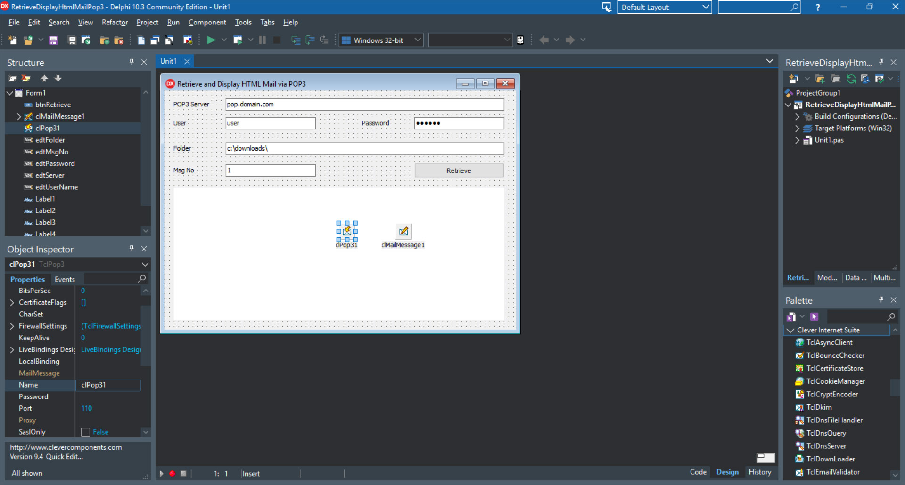

# Retrieve and Display HTML Mail via POP3

The RetrieveDisplayHtmlMailPop3 project represents a code example for the [RetrieveDisplayHtmlMailPop3](https://www.clevercomponents.com/portal/kb/a145/retrieve-and-display-html-mail-via-pop3.aspx) tutorial.

This tutorial represents a POP3 client, which downloads selected Email message from a POP3 mailbox, extracts MIME message parts, and displays the message content. If the message includes an HTML message part, this part is displayed using the TWebBrowser component. Otherwise, a text part is displayed.

The [GitHub/CleverComponents/Clever-Internet-Suite-Tutorials](https://github.com/CleverComponents/Clever-Internet-Suite-Tutorials) repository represents a list of examples, code snippets and demo projects for the [Clever Internet Suite Tutorials](https://www.clevercomponents.com/articles/article035/) article. This list will be periodically updated, new projects will be added.   
Please stay tuned to new examples and use cases of the [Clever Internet Suite](https://www.clevercomponents.com/products/inetsuite/) library.

**How to compile and run** - see [Lib/ReadMe](./Lib/ReadMe.md)   
