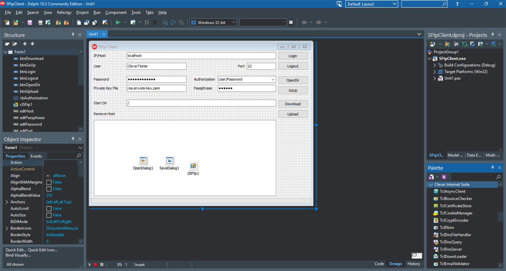

# SFTP Client with User and Public Key Authorization

The SFTP Client project represents a code example for the [SFTP Client with User and Public Key Authorization](https://www.clevercomponents.com/portal/kb/a64/e-mail-replying-forwarding.aspx) tutorial.   

This example connects to an SFTP host via the Secure Shell protocol (SSH), authorizes with the user/password or the Public Key algorithms, lists, downloads, and uploads files.   

The [GitHub/CleverComponents/Clever-Internet-Suite-Tutorials](https://github.com/CleverComponents/Clever-Internet-Suite-Tutorials) repository represents a list of examples, code snippets and demo projects for the [Clever Internet Suite Tutorials](https://www.clevercomponents.com/articles/article035/) article. This list will be periodically updated, new projects will be added.   
Please stay tuned to new examples and use cases of the [Clever Internet Suite](https://www.clevercomponents.com/products/inetsuite/) library.
