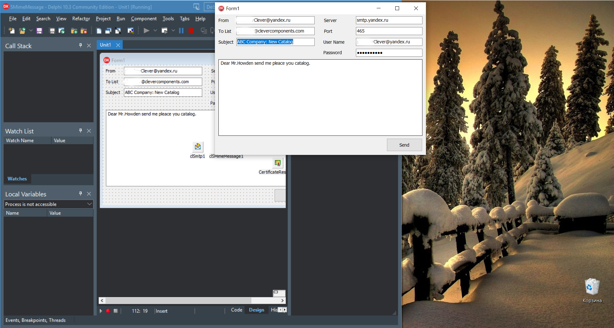

# Send S/MIME Message

The Send S/MIME Message project represents a code example for the [Send S/MIME Message](https://www.clevercomponents.com/portal/kb/a150/send-s-mime-message.aspx) tutorial.   

This tutorial signs and encrypts an Email message in the S/MIME format using X509 certificates, and sends the protected message via the SMTP protocol.

The [GitHub/CleverComponents/Clever-Internet-Suite-Tutorials](https://github.com/CleverComponents/Clever-Internet-Suite-Tutorials) repository represents a list of examples, code snippets and demo projects for the [Clever Internet Suite Tutorials](https://www.clevercomponents.com/articles/article035/) article. This list will be periodically updated, new projects will be added.   
Please stay tuned to new examples and use cases of the [Clever Internet Suite](https://www.clevercomponents.com/products/inetsuite/) library.
