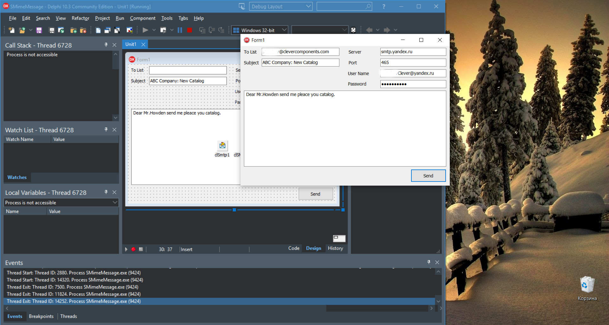

# Send S/MIME Message

The Send S/MIME Message project demonstrates how to send signed and encrypted Email messages using the S/MIME protocol with X.509 certificates and the Clever Internet Suite library. This example shows how to protect Email messages with digital signatures and encryption before sending them via SMTP.

The complete tutorial and detailed step-by-step instructions can be found at [Clever Components Portal: Send S/MIME Message](https://www.clevercomponents.com/portal/kb/a150/send-s-mime-message.aspx)

## Overview

This Delphi application demonstrates:

* How to sign Email messages using sender's X.509 certificate with private key
* How to encrypt Email messages using recipients' X.509 certificates
* How to configure S/MIME message properties (signing and encryption algorithms)
* How to load certificates from files when not installed in Windows certificate store
* How to send protected S/MIME messages via SMTP with TLS encryption

## Features

* **S/MIME Support**: Full implementation of S/MIME protocol for Email security
* **Digital Signatures**: Message signing with SHA-512 algorithm and X.509 certificates
* **Message Encryption**: AES-based encryption using recipients' public certificates
* **Certificate Management**: Flexible certificate loading from Windows store or files (.pfx, .cer)
* **Event-driven Architecture**: Certificate selection events for custom certificate handling

## Usage

### Prerequisites
1. Obtain valid X.509 certificates for sender and recipients
2. Configure SMTP server credentials (e.g., smtp.domain.com)
3. For testing, generate self-signed certificates or use trusted certificates
4. For local testing, you can use our [SMTP Server Example](https://github.com/CleverComponents/Clever-Internet-Suite-Examples/tree/master/Delphi/SmtpServer) to create a local mail server environment

### Step-by-Step

1. **Configure SMTP Settings**:
   - Enter SMTP server address and port (465 for implicit TLS)
   - Provide authentication credentials (username and password)

2. **Prepare Message**:
   - Enter recipient Email addresses (comma-separated for multiple recipients)
   - Specify message subject and body text

3. **Certificate Setup**:
   - Ensure sender certificate with private key is available (from Windows store or .pfx file)
   - Ensure recipient certificates are available (from Windows store or .cer files)

4. **Send Protected Message**:
   - Click "Send" button to sign, encrypt, and transmit the message
   - The application handles certificate selection, message protection, and SMTP delivery

### Certificate Management Options

**Option A: Windows Certificate Store**
- Install sender certificate in "Personal" store (Current User) with private key
- Install recipient certificates in "Other People" store (Current User)
- Email addresses in certificates must match message sender/recipient addresses

**Option B: Certificate Files**
- Place `sender.pfx` (with private key) in application directory
- Use `OnGetSigningCertificate` event to load certificate

## Application Scenarios

* **Secure Business Communication**: Exchange confidential business documents with verified identities
* **Compliance Requirements**: Meet regulatory requirements for Email security (HIPAA, GDPR, etc.)
* **Financial Transactions**: Send sensitive financial information with integrity protection
* **Legal Correspondence**: Ensure authenticity and confidentiality of legal communications
* **Healthcare Information**: Protect patient health information in Email communications

## Requirements

* **Delphi Version**: Delphi 7 or later
* **Clever Internet Suite**: Version 10 or later
* **Operating System**: Windows with CryptoAPI support
* **Network**: Internet connection for SMTP communication
* **Certificates**: X.509 certificates with appropriate key usage (digitalSignature, keyEncipherment)

The project was compiled with Clever Internet Suite version 12. Tutorials and project files for previous versions can be found in the [Releases](https://github.com/CleverComponents/Clever-Internet-Suite-Tutorials/releases) section.

## Repository

The [GitHub/CleverComponents/Clever-Internet-Suite-Tutorials](https://github.com/CleverComponents/Clever-Internet-Suite-Tutorials) repository contains a collection of examples, code snippets, and demo projects for the [Clever Internet Suite Tutorials](https://www.clevercomponents.com/articles/article035/). It will be updated periodically with new projects.

Stay tuned for new examples and use cases of the [Clever Internet Suite](https://www.clevercomponents.com/products/inetsuite/) library.