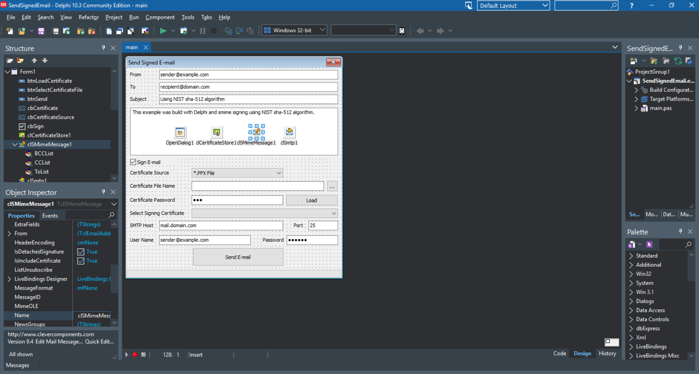

# Send Signed Email



This project demonstrates how to create and send digitally signed email messages using the S/MIME protocol and X.509 certificates from a Delphi application. It showcases the integration of cryptographic email signing with standard SMTP delivery, allowing users to select signing certificates from either a PFX/P12 file or the Windows Certificate Store. The example provides a complete GUI for configuring email content, certificate selection, and SMTP server settings, making it a practical reference for implementing secure email communication in Delphi projects.

This is the official tutorial: [Send Signed Email](https://www.clevercomponents.com/portal/kb/a151/send-signed-email.aspx) 

## Overview

This tutorial provides a working example of S/MIME email signing implementation, focusing on:

*   Preparing an email message for signing using the `TclSMimeMessage` component.
*   Loading X.509 certificates from different sources: PFX/P12 files and Windows Certificate Store via `TclCertificateStore`.
*   Digitally signing the email content with the selected certificate.
*   Sending the signed S/MIME message using the `TclSmtp` component.
*   Configurable signing algorithms (e.g., SHA-1, SHA-512) through component properties.

## Features

*   **S/MIME Signing**: Implements digital signatures for email integrity and non-repudiation.
*   **Flexible Certificate Management**:
    *   Load certificates from password-protected PFX/P12 files.
    *   Access certificates installed in the Windows Personal (MY) store.
*   **Certificate Validation**: Basic checks for certificate suitability and email address matching.
*   **Configurable Signing Algorithm**: The signing hash algorithm can be changed via the `TclSMimeMessage.Config.SignAlgorithmName` and `SignAlgorithm` properties.
*   **SMTP Integration**: Sends signed messages through any standard SMTP server with authentication support.
*   **User-Friendly Interface**: Simple form for entering all necessary email and connection parameters.

## Usage

### Step 1: Configure the Application
1.  Open the project in your Delphi IDE (RAD Studio).
2.  Ensure the Clever Internet Suite components are installed and accessible.
3.  Compile and run the application.

### Step 2: Prepare Your Certificate
You need a valid X.509 certificate with a private key for signing:
*   **Option A (PFX File)**: Have a `.pfx` or `.p12` file and its password ready.
*   **Option B (Windows Store)**: Ensure the certificate is installed in the **Current User -> Personal (My)** certificate store.

### Step 3: Send a Signed Email
1.  **Email Details**: Enter the sender, recipient, subject, and message text in the corresponding fields.
2.  **Enable Signing**: Ensure the "Sign E-mail" checkbox is checked.
3.  **Select Certificate Source**:
    *   Choose "*.PFX File", then browse and select your certificate file. Enter the certificate password.
    *   Or choose "Windows Personal Certificate Store".
4.  **Load Certificate**: Click the **Load** button to populate the certificate list.
5.  **Select Certificate**: Choose your desired signing certificate from the dropdown list.
6.  **Configure SMTP**: Enter your SMTP server details (host, port, username, password).
    *   *For testing purposes, you can use our example SMTP server: [Clever SMTP Server Example](https://github.com/CleverComponents/Clever-Internet-Suite-Examples/tree/master/Delphi/SmtpServer)*
7.  **Send**: Click the **Send E-mail** button. The application will sign the message and send it via SMTP. A progress bar will show the sending status.

### Changing the Signing Algorithm
The default signing algorithm is SHA-1. To use a different algorithm (e.g., SHA-512):

1.  **At Design-Time**:
    *   Select the `clSMimeMessage1` component.
    *   In the Object Inspector, locate the `Config` property and expand it.
    *   Change both properties:
        *   `SignAlgorithmName` - set to the display name (e.g., 'sha-512')
        *   `SignAlgorithm` - set to the corresponding OID (e.g., '2.16.840.1.101.3.4.2.3' for SHA-512)

2.  **At Run-Time** (in code):
    ```delphi
    clSMimeMessage1.Config.SignAlgorithmName := 'sha-512';
    clSMimeMessage1.Config.SignAlgorithm := '2.16.840.1.101.3.4.2.3';
    ```

**Note**: Constants for common algorithm OIDs are declared in the `clCryptAPI.pas` unit (e.g., `szOID_NIST_sha512`).

## Application Scenarios

*   **Secure Business Communication**: Sending legally binding or sensitive correspondence where message integrity and sender authenticity are required.
*   **Compliance with Regulations**: Meeting industry standards (like GDPR, HIPAA) that mandate cryptographic protection for electronic communications.
*   **Automated System Notifications**: Sending signed alerts or reports from server applications where forgery protection is critical.
*   **Email Client Features**: Adding S/MIME signing capability to custom email client software developed in Delphi.

## Requirements

*   **Delphi / RAD Studio**: Version 7 or higher.
*   **Clever Internet Suite**: Version 10.0 or higher. The project relies on `TclSmtp`, `TclSMimeMessage`, and `TclCertificateStore` components.
    > The project was compiled with Clever Internet Suite version 12. Tutorials and project files for previous versions can be found in the [Releases](https://github.com/CleverComponents/Clever-Internet-Suite-Tutorials/releases) section.
*   **Cryptographic Certificate**: An X.509 certificate with a private key, either as a PFX/P12 file or installed in the Windows Certificate Store.
*   **SMTP Server Access**: Access to an SMTP server for sending email (can be local or remote like Gmail, Office 365, etc.).

## Repository

The [GitHub/CleverComponents/Clever-Internet-Suite-Tutorials](https://github.com/CleverComponents/Clever-Internet-Suite-Tutorials) repository contains a collection of examples, code snippets, and demo projects for the [Clever Internet Suite Tutorials](https://www.clevercomponents.com/articles/article035/). It will be updated periodically with new projects.

Stay tuned for new examples and use cases of the [Clever Internet Suite](https://www.clevercomponents.com/products/inetsuite/) library.