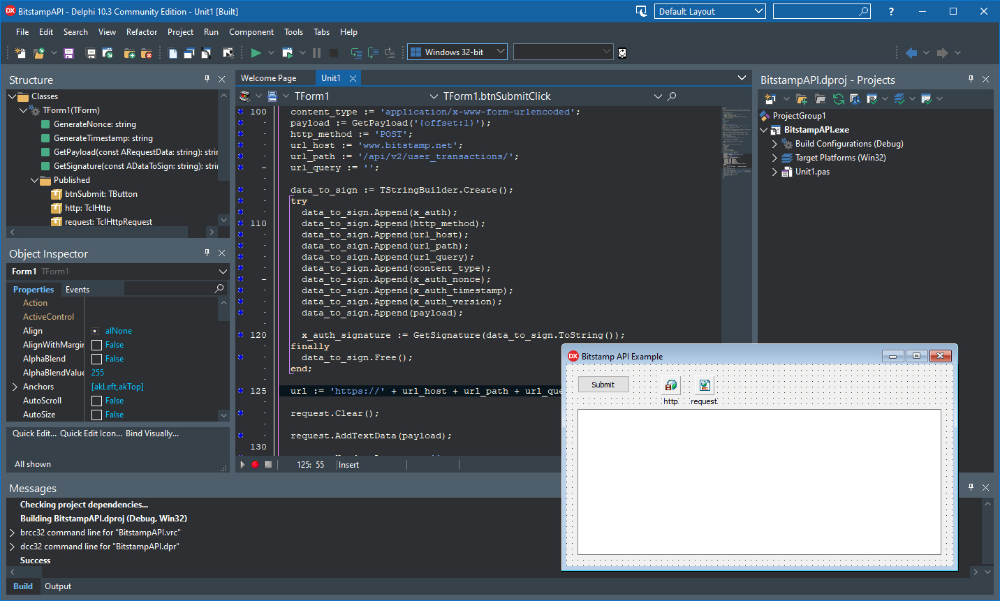

# Connect Bitstamp API from Delphi

The BitstampAPI project is a code example for the [Connect Bitstamp API from Delphi](https://www.clevercomponents.com/portal/kb/a176/connect-bitstamp-api-from-delphi.aspx) tutorial.

This program is a C++ example converted to Delphi, originally published in the Bitstamp API documentation. The example demonstrates authenticating with the Bitstamp REST service, filling the required request fields, and making a sample API call.

## Overview

This tutorial demonstrates how to connect to the Bitstamp cryptocurrency exchange API using Delphi by:
- **Generating authentication signatures** using HMAC-SHA256
- **Creating proper API request headers** according to Bitstamp specifications
- **Handling timestamp and nonce generation** for request security
- **Sending authenticated POST requests** to Bitstamp's REST API
- **Processing API responses** for user transactions and other data

---

## 🔔 Get Updates

We publish practical integration examples and technical guides for Clever Components products.

If you'd like to receive updates when new tutorials and component examples are released, you can subscribe here:

👉 https://www.clevercomponents.com/home/maillist.asp

---

## Features

- **HMAC-SHA256 Authentication**: Secure signing of API requests using cryptographic hashing
- **Bitstamp API Compliance**: Follows Bitstamp's authentication protocol (v2)
- **Timestamp Management**: Accurate timestamp generation for request validity
- **Nonce Generation**: Unique request identifiers using GUIDs
- **HTTP POST Requests**: Sending form-encoded data to Bitstamp endpoints
- **Response Handling**: Displaying API responses in a user-friendly format
- **Proxy Support**: Configurable proxy settings for network flexibility

## Usage

1. **Configure API Credentials**: Replace the `api_key` and `api_secret` constants with your Bitstamp API credentials
2. **Set Target Endpoint**: Modify the `url_path` variable to target different Bitstamp API endpoints
3. **Adjust Request Data**: Update the payload to include required parameters for your API call
4. **Run the Application**: Click "Submit" to send the authenticated request to Bitstamp
5. **View Response**: Check the memo control for the API response data

**Note**: The example uses the user transactions endpoint (`/api/v2/user_transactions/`) but can be adapted for other Bitstamp API endpoints.

## Application Scenarios

- **Cryptocurrency Trading Applications**: Integrate Bitstamp trading functionality into Delphi applications
- **Portfolio Management Tools**: Retrieve account balances and transaction history
- **Automated Trading Bots**: Execute trades programmatically using Bitstamp API
- **Market Data Analysis**: Access real-time cryptocurrency market data
- **Payment Processing**: Accept cryptocurrency payments through Bitstamp
- **Financial Reporting**: Generate reports on cryptocurrency holdings and transactions

## Implementation Details

### Authentication Process
1. **Nonce Generation**: Creates a unique GUID for each request
2. **Timestamp Creation**: Uses Unix timestamp in milliseconds
3. **Payload Encoding**: Form-encodes request data
4. **Signature Generation**: Creates HMAC-SHA256 signature using API secret
5. **Header Construction**: Builds authentication headers with signature, nonce, and timestamp

### Security Features
- **API Key Authentication**: Identifies the application to Bitstamp
- **HMAC Signatures**: Ensures request integrity and authenticity
- **Timestamp Validation**: Prevents replay attacks
- **Unique Nonces**: Ensures each request is distinct

## Requirements

- **Delphi Version**: Delphi 7 or higher
- **Clever Internet Suite**: Version 10.0 or higher
- **Bitstamp API Credentials**: Valid API key and secret from Bitstamp

**Note**: The project was compiled with Clever Internet Suite version 12. Tutorials and project files for previous versions can be found in the [Releases](https://github.com/CleverComponents/Clever-Internet-Suite-Tutorials/releases) section.

## Compilation Instructions

This project uses several components from Clever Internet Suite:
- **TclHttp**: For HTTP communication with Bitstamp API
- **TclHttpRequest**: For building HTTP requests
- **TclHmacSha256**: For generating authentication signatures
- **TclTranslator**: For byte array conversions
- **clUriUtils**: For URL and form encoding utilities

All components are included in the standard Clever Internet Suite installation.

## See Also

- [Bitstamp API Documentation](https://www.bitstamp.net/api/) - Official Bitstamp API reference and documentation
- [How to write a REST client with JSON in Delphi](https://github.com/CleverComponents/Clever-Internet-Suite-Tutorials/tree/master/vcl/RestClientSendReceiveJson) - General REST client implementation with JSON support

## Repository

The [GitHub/CleverComponents/Clever-Internet-Suite-Tutorials](https://github.com/CleverComponents/Clever-Internet-Suite-Tutorials) repository contains a collection of examples, code snippets, and demo projects.

It is updated periodically with new integration scenarios and component examples.

