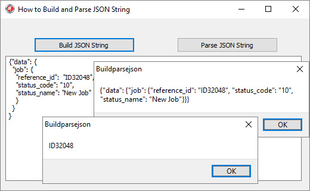

# How to Build and Parse a JSON String with Objects

The BuildParseJSON project represents a code example for the [How to Build and Parse a JSON String with Objects](https://www.clevercomponents.com/portal/kb/a133/how-to-build-and-parse-a-json-string-with-objects.aspx) tutorial.

This tutorial makes a JSON request, which includes objects and object properties. It also includes code, which parses received JSON response and extracts all included object properties.

See also:  
[How to send a GET request with JSON data](https://www.clevercomponents.com/portal/kb/a125/how-to-send-a-get-request-with-json-data.aspx)  
[How to Post JSON data](https://www.clevercomponents.com/portal/kb/a78/how-to-post-json-data.aspx)  
[How to make a PUT HTTP request with JSON data](https://www.clevercomponents.com/portal/kb/a110/how-to-make-the-put-http-request-with-json-data.aspx)

---

🔔 New integration examples are published regularly.
Subscribe: https://www.clevercomponents.com/home/maillist.asp

---

## Repository

The [GitHub/CleverComponents/Clever-Internet-Suite-Tutorials](https://github.com/CleverComponents/Clever-Internet-Suite-Tutorials) repository contains a collection of examples, code snippets, and demo projects.

It is updated periodically with new integration scenarios and component examples.
