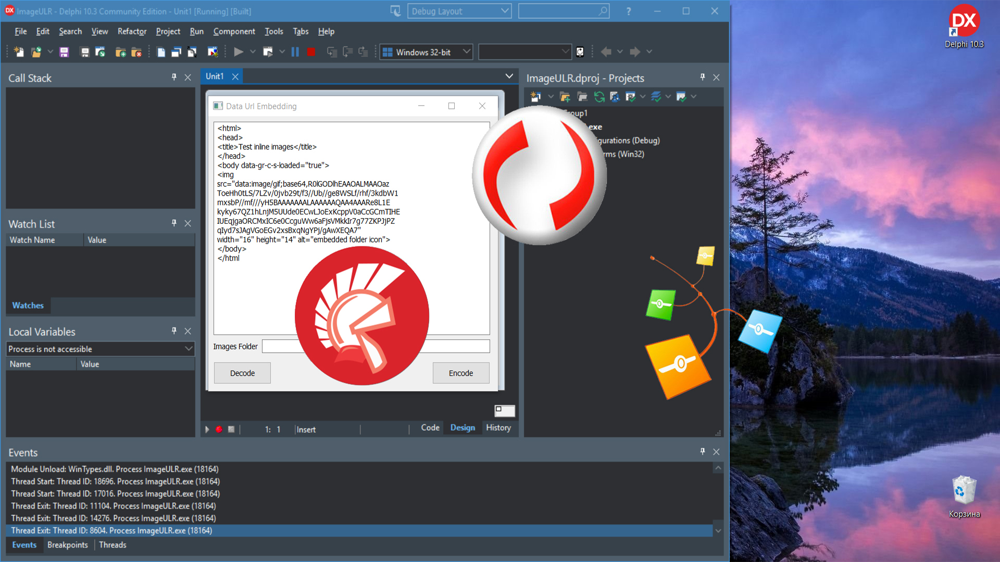

# Data URL Embedding

The Data URL Embedding project is a code example for the [Data URL Embedding](https://www.clevercomponents.com/portal/kb/a162/data-url-embedding.aspx) tutorial.

This example shows how to encode and decode images using the data:URL format to embed them directly in HTML documents.

   

## Overview

This tutorial demonstrates how to work with Data URLs (RFC 2397) for embedding images in HTML by:
- **Encoding images** from files on disk into Base64-encoded Data URL strings
- **Decoding Data URLs** back into image files on the local filesystem
- **Processing HTML documents** to automatically convert image references
- **Supporting multiple image formats** including GIF, JPEG, and PNG

---

## 🔔 Get Updates

We publish practical integration examples and technical guides for Clever Components products.

If you'd like to receive updates when new tutorials and component examples are released, you can subscribe here:

👉 https://www.clevercomponents.com/home/maillist.asp

---

## Features

- **HTML Parsing**: Automatically identifies and processes image tags in HTML documents
- **Data URL Encoding**: Converts image files to Base64-encoded data URLs with proper MIME types
- **Data URL Decoding**: Extracts images from data URLs and saves them as files
- **Format Detection**: Handles different image formats (GIF, JPEG, PNG) with appropriate MIME types
- **File Management**: Generates unique filenames to prevent overwriting existing files
- **Batch Processing**: Processes all images in an HTML document with a single click

## Usage

1. **Prepare HTML**: Load or type HTML containing image references in the memo control
2. **Set Images Folder**: Specify the folder where images are stored or should be saved
3. **Encode Images**: Click "Encode" to convert image file references to data URLs
4. **Decode Images**: Click "Decode" to extract images from data URLs and save as files

**Example Workflow:**
- Load HTML with ``
- Set images folder to "C:\MyImages\"
- Click "Encode" → Converts to ``
- Click "Decode" → Saves image as "C:\MyImages\testImage.gif"

## Application Scenarios

- **Email Templates**: Create self-contained HTML emails with embedded images
- **Web Development**: Generate HTML with inline images for faster loading
- **Document Generation**: Produce portable HTML documents with embedded graphics
- **Content Archiving**: Save web pages with all images included in single HTML files
- **Offline Applications**: Create HTML content that works without external image files
- **Testing & Debugging**: Quickly convert between file-based and embedded images

## Requirements

- **Delphi 7 or later** (compatible with wide range of Delphi versions)
- **Clever Internet Suite version 10**. Tutorials and project files for previous versions can be found in the [Releases](https://github.com/CleverComponents/Clever-Internet-Suite-Tutorials/releases) section.
- **Windows** operating system

## Compilation Instructions

This project uses two components from Clever Internet Suite:
- **TclHtmlParser**: For parsing HTML and extracting image tags
- **TclEncoder**: For Base64 encoding and decoding operations

Both components are included in the standard Clever Internet Suite installation and require no additional configuration.

## Repository

The [GitHub/CleverComponents/Clever-Internet-Suite-Tutorials](https://github.com/CleverComponents/Clever-Internet-Suite-Tutorials) repository contains a collection of examples, code snippets, and demo projects.

It is updated periodically with new integration scenarios and component examples.
