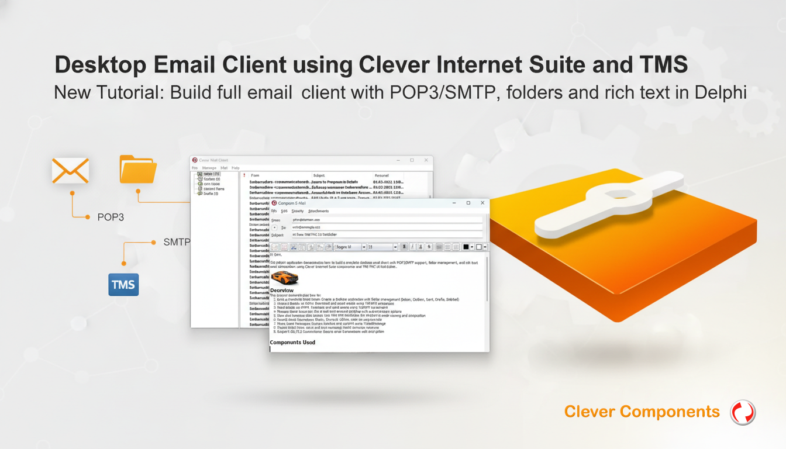

# Desktop Email Client using Clever Internet Suite and TMS FNC RichEditor

This Delphi application demonstrates how to build a complete desktop email client with POP3/SMTP support, folder navigation, and rich text email composition using Clever Internet Suite components and TMS FNC UI RichEditor.

## Overview

This tutorial demonstrates how to:

- **Build a Complete Email Client**: Create a desktop application with folder management (Inbox, Outbox, Sent, Drafts, Deleted)
- **Receive Emails via POP3**: Download and parse emails using TclPOP3 component
- **Send Emails via SMTP**: Compose and send emails using TclSMTP component
- **Manage Email Accounts**: Store and load account settings with authentication options
- **View and Compose Rich Emails**: Use TMS FNC RichEditor for WYSIWYG email viewing and composition
- **Handle Email Operations**: Reply, forward, delete, mark as read/unread
- **Parse Email Messages**: Extract headers and content using TclMailMessage
- **Persist Email Data**: Save and load messages locally between sessions
- **Support SSL/TLS Connections**: Secure email transmission with encryption

## Components Used

### Clever Internet Suite Components:
- **TclPOP3**: POP3 client component for receiving emails
- **TclSMTP**: SMTP client component for sending emails
- **TclMailMessage**: Email message component for parsing and creating MIME-formatted emails
- **TclHtmlParser**: HTML parser component for extracting text from HTML content
- **TclCertificate**: SSL/TLS certificate handling component

### TMS FNC UI Pack Components:
- **TTMSFNCRichEditor**: Rich text editor component for WYSIWYG email viewing and composition
- **TTMSFNCRichEditorHTMLIO**: HTML import/export for the rich editor
- **TTMSFNCRichEditorEditToolBar**: Editing toolbar for the rich editor
- **TTMSFNCRichEditorFormatToolBar**: Formatting toolbar for the rich editor

### Delphi Standard Components:
- **TListView**: Message list display
- **TTreeView**: Folder navigation
- **TRichEdit**: Raw message source viewing

## Usage

1. **Configure Email Account**:
   - Click "Accounts" in the menu or toolbar
   - Enter your name and email address
   - Configure POP3 and SMTP server settings (server, port, username, password)
   - Enable SSL/TLS if required by your email provider
   - Set authentication method (SASL/SPA if needed)

2. **Receive Emails**:
   - Select the "Inbox" folder
   - Click "Receive" to download new messages from POP3 server
   - View messages in the list with sender, subject, date, and priority indicators

3. **View Emails**:
   - Double-click a message or select and press Enter
   - View formatted email content in the rich editor
   - See attachments in the attachments panel
   - Use "View Source" to see raw email headers and content

4. **Compose New Email**:
   - Click "New Message" or use Ctrl+N
   - Enter recipients in To, CC, BCC fields
   - Add subject and compose message using rich formatting tools
   - Attach files using "Add File" button
   - Set priority if needed
   - Click "Send" to send immediately or save as draft

5. **Manage Emails**:
   - **Reply**: Send response to the sender
   - **Reply All**: Reply to all recipients
   - **Forward**: Forward message to other recipients
   - **Delete**: Move message to Deleted Items
   - **Mark as Read/Unread**: Change message status
   - **Save Message**: Export email to .eml file

6. **Send Pending Emails**:
   - Select "Outbox" folder to see unsent messages
   - Click "Send" to send all pending messages
   - Sent messages automatically move to "Sent Items"

## Application Scenarios

- **Desktop Email Clients**: Build standalone email applications for Windows
- **Corporate Email Systems**: Implement internal email clients with custom features
- **Customer Support Tools**: Create tools for managing support email communications
- **Email Archiving Systems**: Build applications for email backup and management
- **Educational Tools**: Teach email protocol implementation (POP3/SMTP)
- **Notification Systems**: Create systems for sending and receiving formatted notifications
- **Email Testing Tools**: Develop applications for testing email server configurations

## Prerequisites

Before running this tutorial, ensure you have:

1. **Clever Internet Suite** (version 10 or compatible) installed
2. **TMS FNC UI Pack** installed (for rich editor functionality)
3. **Delphi 10.1 Berlin or later** (TMS FNC components require Delphi 10.1+)
4. Windows compatible operating system

**Note**: This example uses TMS FNC RichEditor component which requires TMS FNC UI Pack library. The TMS FNC UI Pack officially supports Delphi 10.1 Berlin and later versions. Alternative rich editor components can be used with similar functionality.

The project was compiled with Clever Internet Suite version 12. Tutorials and project files for previous versions can be found in the [Releases](https://github.com/CleverComponents/Clever-Internet-Suite-Tutorials/releases) section.

## Compilation Instructions

1. Clone the repository from [GitHub/CleverComponents/Clever-Internet-Suite-Tutorials](https://github.com/CleverComponents/Clever-Internet-Suite-Tutorials)
2. Download and install [Clever Internet Suite](https://www.clevercomponents.com/downloads/inetsuite/suitedownload.asp)
3. Download and install [TMS FNC UI Pack](https://www.tmssoftware.com/site/tmsfncuipack.asp) (requires Delphi 10.1+)
4. Open the DesktopEmailClientTMSRichEditor.dproj project in your Delphi IDE
5. Compile and run the application

## Related Examples

- [MailSend with TMS FNC RichEditor](https://github.com/CleverComponents/Clever-Internet-Suite-Tutorials/tree/master/vcl/MailSend-TMS-RichEditor): Simple email composition and sending example
- [GMail SMTP Client](https://github.com/CleverComponents/Clever-Internet-Suite-Examples/tree/master/Delphi/GMailSMTP): Example using OAUTH2.0 authentication with GMail
- [POP3 Client SSL](https://github.com/CleverComponents/Clever-Internet-Suite-Examples/tree/master/Delphi/Pop3ClientSSL): Example demonstrating SSL/TLS connections to POP3 servers
- [MailMessage Umlauts](https://github.com/CleverComponents/Clever-Internet-Suite-Tutorials/tree/master/vcl/MailMessageUmlauts): Example handling international characters in emails

## Repository

The [GitHub/CleverComponents/Clever-Internet-Suite-Tutorials](https://github.com/CleverComponents/Clever-Internet-Suite-Tutorials) repository contains a collection of examples, code snippets, and demo projects for the [Clever Internet Suite Tutorials](https://www.clevercomponents.com/articles/article035/). It will be updated periodically with new projects.

Stay tuned for new examples and use cases of the [Clever Internet Suite](https://www.clevercomponents.com/products/inetsuite/) library.
