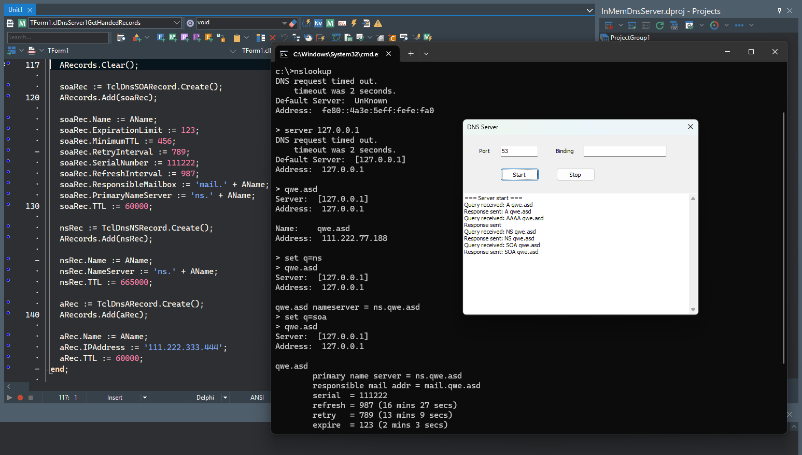

# DnsServerHanded - In-Memory DNS Server Implementation

A lightweight, customizable DNS server that resolves domain names using an in-memory data store. Built with **Clever Internet Suite** for robust DNS protocol handling. Designed for educational purposes, testing, and custom DNS routing scenarios.  

**Built with** [Clever Internet Suite](https://www.clevercomponents.com/products/inetsuite/) – comprehensive library for Internet protocols.

## Overview

This project implements a DNS server that:

* Uses **Clever Internet Suite** for DNS protocol implementation
* Stores domain-to-IP mappings in memory (hash table/dictionary)
* Responds to DNS queries with predefined IP addresses
* Serves as a teaching tool for DNS protocol understanding
* Provides a foundation for custom DNS solutions

## Features

* Simple in-memory domain-IP mapping
* Basic DNS query handling (A records)
* Easy configuration and extension
* Educational code structure with clear comments

## Tutorial

This code accompanies the tutorial: [Build a DNS server that responds with an in-memory list of IPs based on the name submitted](https://www.clevercomponents.com/portal/kb/a89/build-a-dns-server-that-responds-with-an-in-memory-list-of-ips-based-on-the-name-submitted_.aspx)

## Project folders

* Delphi — contains source code for Delphi (XE3, and newer).
* CBuilder — contains source code for C++Builder XE3. Before compiling with newer versions of C++Builder, open the *.cbproj files and replace clinetsuite_xe3.lib (and .bpi) with clinetsuite_XXX.lib (.bpi), where XXX is 13 for C++Builder 13, xe8 for C++Builder XE8, etc.

The projects were compiled with Clever Internet Suite version 12.  
Tutorials and project files for previous versions of Clever Internet Suite can be found in the [Releases](https://github.com/CleverComponents/Clever-Internet-Suite-Tutorials/releases) section.

## Repository

The [GitHub/CleverComponents/Clever-Internet-Suite-Tutorials](https://github.com/CleverComponents/Clever-Internet-Suite-Tutorials) repository contains a collection of examples, code snippets, and demo projects for the [Clever Internet Suite Tutorials](https://www.clevercomponents.com/articles/article035/). It will be updated periodically with new projects.

Stay tuned for new examples and use cases of the [Clever Internet Suite](https://www.clevercomponents.com/products/inetsuite/) library.

