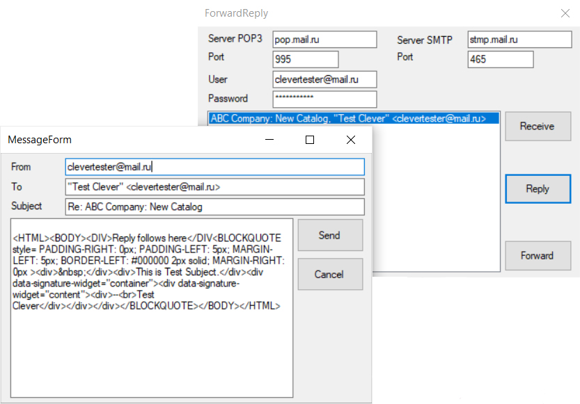

# Email Forwarding and Replying Example

A practical demonstration of email reply and forward functionality implemented with Clever Internet Suite.

[Clever Internet Suite](https://www.clevercomponents.com/products/inetsuite/)
[Tutorial Article](https://www.clevercomponents.com/portal/kb/a64/e-mail-replying-forwarding.aspx)

The ForwardReply project is a code example for the [E-mail replying / forwarding](https://www.clevercomponents.com/portal/kb/a64/e-mail-replying-forwarding.aspx) tutorial.   

## Overview

This application demonstrates how to:

- Receive email messages from a mail server
- Create replies to selected emails (with quoted original content)
- Forward emails to other recipients
- Handle email headers during reply/forward operations

The project was compiled with Clever Internet Suite version 12.  
Tutorials and project files for previous versions of Clever Internet Suite can be found in the [Releases](https://github.com/CleverComponents/Clever-Internet-Suite-Tutorials/releases) section.

## Application Flow

1. Configure POP3/SMTP server settings
2. Retrieve email list from POP3 server
3. Select message and choose Reply/Forward
4. Edit content in separate message dialog
5. Send via SMTP server

## Repository

The [GitHub/CleverComponents/Clever-Internet-Suite-Tutorials](https://github.com/CleverComponents/Clever-Internet-Suite-Tutorials) repository contains a collection of examples, code snippets, and demo projects for the [Clever Internet Suite Tutorials](https://www.clevercomponents.com/articles/article035/). It will be updated periodically with new projects.

Stay tuned for new examples and use cases of the [Clever Internet Suite](https://www.clevercomponents.com/products/inetsuite/) library.

