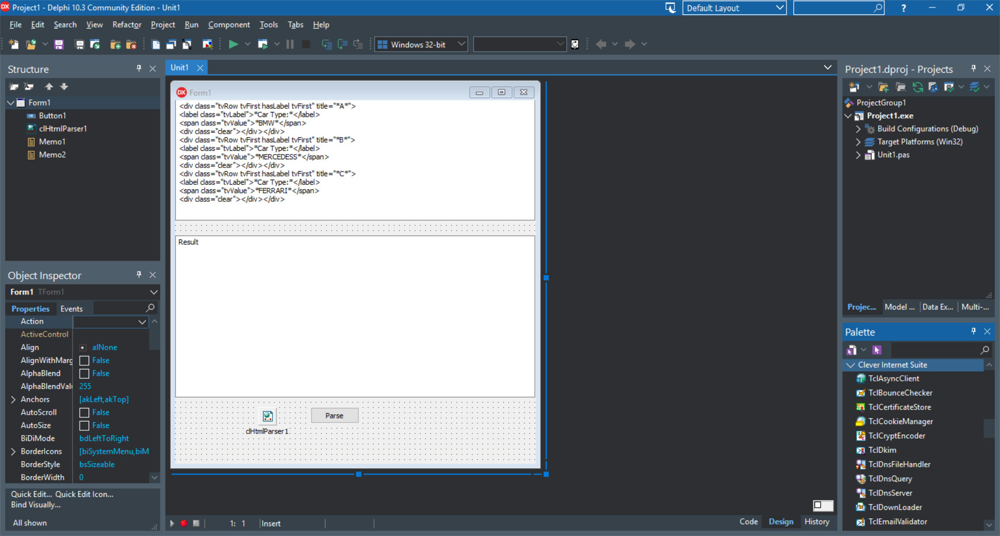

# Parse Inner HTML

The HtmlParserInnerHtml project represents a code example for the [Parse inner HTML](https://www.clevercomponents.com/portal/kb/a76/parse-inner-html.aspx) tutorial.   

The sample demonstrates how to extract inner HTML content from specific tags using the TclHtmlParser component with dynamic filtering capabilities.   



<br clear="both">

## Overview

This project shows how to parse HTML documents and extract inner HTML content from specific elements using the TclHtmlParser component from Clever Internet Suite. The example demonstrates advanced HTML parsing techniques, including dynamic tag filtering, tag navigation, and inner content extraction based on user-specified criteria.

The project was compiled with Clever Internet Suite version 12.  
Tutorials and project files for previous versions of Clever Internet Suite can be found in the [Releases](https://github.com/CleverComponents/Clever-Internet-Suite-Tutorials/releases) section.


## Features

- Parse HTML documents and navigate tag hierarchies
- Extract inner HTML content from specific elements
- **Dynamic filtering** by tag name, attribute name, and attribute value
- Case-insensitive comparison for flexible matching
- Handle both opening and closing tags
- Process text nodes within HTML structure
- Visual interface with source and result panels
- Support for complex HTML nesting scenarios
- Real-time results with matching tag count


## Usage

1. **Paste HTML content** into the top memo (source) panel
2. **Configure filters** in the input fields:
   - **Tag Name**: HTML tag to search for (e.g., `div`, `span`, `p`)
   - **Attribute Name**: HTML attribute to filter by (e.g., `class`, `id`, `title`)
   - **Attribute Value**: Value to match against the specified attribute
3. **Click "Parse"** to process the HTML
4. **View results** in the bottom memo panel showing:
   - Number of matching tags found
   - Extracted inner HTML content for each match

**Note**: Leave any filter field empty to ignore that criteria in the search.


## Code Highlights

```pascal
procedure TForm1.Button1Click(Sender: TObject);
var
  i: Integer;
  tag: TclHtmlTag;
  TagName, AttrName, AttrValue: string;
  FoundCount: Integer;
begin
  Memo2.Lines.Clear();
  FoundCount := 0;

  // Get filter criteria from input fields
  TagName := Trim(edtTagName.Text);
  AttrName := Trim(edtAttributeName.Text);
  AttrValue := Trim(edtAttributeValue.Text);

  // Configure parser
  clHtmlParser1.IncludeClosingTags := True;
  clHtmlParser1.ParseMethod := pmAll;
  clHtmlParser1.Parse(Memo1.Lines);

  // Parse and filter tags
  for i := 0 to clHtmlParser1.Tags.Count - 1 do
  begin
    tag := clHtmlParser1.Tags[i];
    
    // Apply dynamic filters
    if (TagName = '') or (CompareText(tag.Name, TagName) = 0) then
    begin
      if (AttrName = '') or (CompareText(tag.AttributeValue(AttrName), AttrValue) = 0) then
      begin
        Inc(FoundCount);
        Memo2.Lines.Text := Memo2.Lines.Text + GetInnerHtml(tag.Owner, tag) + #13#10;
      end;
    end;
  end;

  // Show statistics
  if FoundCount > 0 then
  begin
    Memo2.Lines.Insert(0, Format('Found %d matching tag(s) with content:', [FoundCount]));
    Memo2.Lines.Insert(1, '=============================================');
  end else
  begin
    Memo2.Lines.Text := 'No elements found matching the specified criteria.';
  end;
end;
```

## Key Concepts Demonstrated

1. **Tag Navigation**: Using `NextTag` property to traverse HTML structure
2. **Owner Hierarchy**: Understanding tag ownership for nested elements
3. **Attribute Filtering**: Selecting tags based on name and CSS classes
4. **Inner HTML Extraction**: Recursively collecting content between tags
5. **Tag Type Handling**: Differentiating between opening, closing, and text tags


## Application Scenarios

- **Web Scraping**: Extract specific content from web pages
- **HTML Transformation**: Modify or extract portions of HTML documents
- **Content Analysis**: Analyze structure of HTML pages
- **Template Processing**: Extract reusable components from HTML templates
- **Data Extraction**: Retrieve structured data from HTML reports


## Filter Examples

| Tag Name | Attribute Name | Attribute Value | Result |
|----------|---------------|-----------------|--------|
| `div` | `class` | `tvRow tvFirst hasLabel tvFirst` | All divs with specific CSS class |
| `span` | `class` | `tvValue` | All span elements with tvValue class |
| `a` | `href` | `https://example.com` | All links to specific domain |
| `img` | `alt` | `` | All images with alt attribute (any value) |
| `` | `id` | `main-content` | Any element with specific ID |
| `p` | `` | `` | All paragraph tags (no attribute filter) |
| `` | `data-role` | `widget` | Any element with data-role="widget" |
| `h1` | `class` | `title` | All h1 headings with title class |


## Repository

The [GitHub/CleverComponents/Clever-Internet-Suite-Tutorials](https://github.com/CleverComponents/Clever-Internet-Suite-Tutorials) repository contains a collection of examples, code snippets, and demo projects for the [Clever Internet Suite Tutorials](https://www.clevercomponents.com/articles/article035/). It will be updated periodically with new projects.

Stay tuned for new examples and use cases of the [Clever Internet Suite](https://www.clevercomponents.com/products/inetsuite/) library.