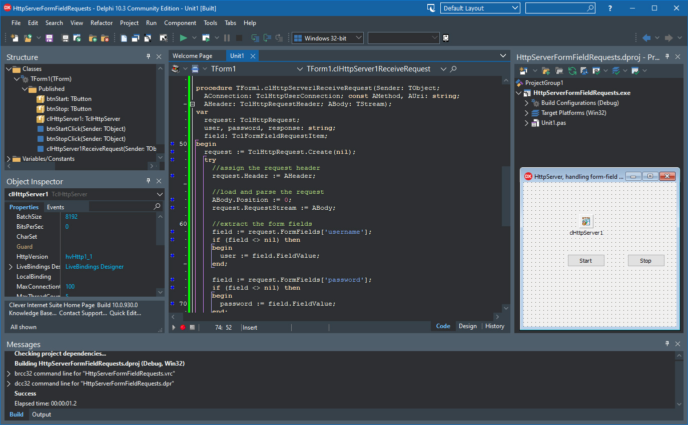

# HttpServer - Handling Form-Field Requests

The HttpServerFormFieldRequests project is a code example for the [HttpServer - handling form-field requests](https://www.clevercomponents.com/portal/kb/a170/httpserver-handling-form-field-requests.aspx) tutorial.

This tutorial demonstrates how to create a simple HTTP server using the TclHttpServer component from the [Http-Server](https://github.com/CleverComponents/Http-Server) repository. The primary focus is on handling HTTP POST requests with form-field data - parsing form submissions, extracting field values, and processing user input.

See also: [Write your own HTTPS Server in Delphi](https://www.clevercomponents.com/articles/article050)   

## Overview

This tutorial demonstrates core form processing capabilities:

- **Display HTML Forms**: Respond to GET requests with HTML forms for user input
- **Process Form Submissions**: Handle POST requests containing form-field data
- **Parse Form Fields**: Extract and process individual form fields (username, password)
- **Form Data Handling**: Access submitted data through the TclHttpRequest component
- **Dynamic Responses**: Generate appropriate HTTP responses based on form input

The implementation uses the TclHttpServer component, which provides robust form parsing capabilities built on Clever Internet Suite components.

## Important Notes

### About TclHttpServer Component
The TclHttpServer component used in this tutorial is **not part of the standard Clever Internet Suite distribution**. It is a separate open-source component available from the [Http-Server repository on GitHub](https://github.com/CleverComponents/Http-Server)

To use this tutorial, you need to:
1. Have Clever Internet Suite installed
2. Download the TclHttpServer sources
3. Install the component to your Delphi environment

### About Port Selection
This tutorial uses port **2110** instead of the standard HTTP port 80 or HTTPS port 443. This design choice serves two purposes:
1. **Avoids conflicts with existing web servers** (like IIS, Apache, or other services) that might be running on your development machine
2. **Doesn't require administrator privileges** to run (standard ports below 1024 typically require elevated permissions on most systems)

Port 2110 was chosen as it's typically unoccupied on most systems, allowing the demo to run without interfering with other web services.

### About HTTPS Configuration
This demo uses **HTTP on port 2110** by default for simplicity. If you need HTTPS with SSL/TLS encryption, you'll need to:
1. Configure a server certificate
2. Adjust the TclHttpServer component settings for TLS

For detailed instructions on HTTPS setup, please refer to the [Write your own HTTPS Server in Delphi](https://www.clevercomponents.com/articles/article050) article.

The project was compiled with Clever Internet Suite version 12.  
Tutorials and project files for previous versions of Clever Internet Suite can be found in the [Releases](https://github.com/CleverComponents/Clever-Internet-Suite-Tutorials/releases) section.

## Features

- **Form Processing Core**: Parse and extract form-field data from POST requests
- **HTTP Server Implementation**: Complete HTTP/HTTPS server using TclHttpServer component from [Http-Server repository (https://github.com/CleverComponents/Http-Server)](https://github.com/CleverComponents/Http-Server)
- **Multiple HTTP Methods**: Support for GET and POST methods with proper routing
- **Error Handling**: Proper HTTP error responses (404, 405, 400)
- **HTML Generation**: Dynamic HTML response generation
- **Server Control**: Start/stop server functionality with status logging

## Prerequisites

Before running this tutorial, ensure you have:

1. **Clever Internet Suite** (version 12 or compatible) installed
2. **TclHttpServer** component
3. The component added to your Delphi component palette
4. Delphi 7 or later (compatible with wide range of Delphi versions)

## Usage

1. **Start the Server**:
   - Click the "Start" button to start the HTTP server
   - The server will listen on the configured port (default: 2110 for HTTP)
   - Server status messages will appear in the log memo

2. **Access the Login Form**:
   - Open a web browser and navigate to `http://localhost:2110/`
   - You will see a simple HTML login form
   - The form has two fields: username and password

3. **Submit Login Data**:
   - Enter a username and password in the form
   - Click the "Login" button to submit the form via POST request
   - The server will process the form data and display a success page

4. **Monitor Server Activity**:
   - All incoming requests are logged in the memo control
   - See timestamps, HTTP methods, and URLs
   - Login attempts are logged with username information

5. **Stop the Server**:
   - Click the "Stop" button to stop the HTTP server
   - All active connections will be closed

## Components Used

### TclHttpServer
The main HTTP server component that handles incoming connections, parses HTTP requests, and manages response sending. This component is built on Clever Internet Suite and provides robust form parsing capabilities.

### Clever Internet Suite Components:
- **TclHttpRequest**: Used to parse incoming POST request bodies and extract form-field data
- **TclHttpRequestHeader**: Represents HTTP request headers, providing access to all header fields
- **TclHttpUserConnection**: Manages individual client connections

## Application Scenarios

- **Form Processing Servers**: Build servers that handle web form submissions
- **API Endpoints**: Create simple RESTful APIs that accept form data
- **Authentication Systems**: Implement login systems with form-based authentication
- **Web Hooks**: Create servers that process web hook notifications with form data
- **Prototyping**: Quickly prototype web applications with server-side processing
- **Educational Tools**: Learn about HTTP protocol and form handling implementation
- **Embedded Web Interfaces**: Add web interfaces to desktop applications

## Form Processing Implementation

### Form Field Parsing and Processing
The core focus of this tutorial is demonstrating how to handle HTTP POST requests with form-field data. The server extracts form fields using the `TclHttpRequest` component's `FormFields` property, which provides easy access to submitted form data by field names.

### Form Request Workflow
The complete form handling workflow includes:
1. **Form Display**: GET request returns HTML form to the client
2. **Form Submission**: Client submits form via POST request with form-data
3. **Form Parsing**: Server parses the form-data using `TclHttpRequest`
4. **Field Extraction**: Individual field values are extracted by name
5. **Response Generation**: Server processes the data and returns appropriate response

### HTTP Response Handling
The server implements proper HTTP status codes for different scenarios:
- **GET /**: Returns HTML login form (200 OK)
- **POST /login**: Successfully processes form data and returns success page (200 OK)
- **Invalid URLs**: Returns 404 Not Found for unrecognized paths
- **Unsupported Methods**: Returns 405 Method Not Allowed for non-GET/POST requests
- **Missing Required Fields**: Returns 400 Bad Request when username is empty

## Key Features of Form Processing

1. **Form-Data Extraction**: Demonstrates parsing of `application/x-www-form-urlencoded` data
2. **Field Access**: Shows how to access individual form fields by name
3. **Request/Response Cycle**: Complete HTTP request/response handling for form submissions
4. **Error Handling**: Proper HTTP status codes for form validation errors
5. **HTML Generation**: Dynamic HTML response generation based on form input

## Advantages of Using TclHttpServer for Form Processing

1. **Built-in Form Parsing**: Native support for parsing form-data without manual string manipulation
2. **Field Access Convenience**: Easy access to form fields through the `FormFields` property
3. **Multi-threaded Support**: Handles multiple concurrent form submissions automatically
4. **Flexible Deployment**: Can be used for both simple forms and complex web applications

## Form Processing Use Cases

This tutorial's form processing techniques can be applied to:
- **User Registration Forms**: Collect and process user registration data
- **Contact Forms**: Handle contact form submissions on websites
- **Search Forms**: Process search queries from web interfaces
- **Configuration Forms**: Update application settings via web forms
- **Feedback Forms**: Collect and process user feedback
- **Order Forms**: Handle e-commerce order submissions

## Requirements

- **Delphi 7 or later** (compatible with wide range of Delphi versions)
- **Clever Internet Suite 12** or compatible version
- **TclHttpServer component** from [Http-Server](https://github.com/CleverComponents/Http-Server) repository
- **Windows** compatible operating system

## Extending Form Processing

The form handling demonstrated can be extended for:
1. **Multiple Form Types**: Support different forms with various field sets
2. **File Uploads**: Handle multipart form-data with file attachments
3. **Form Validation**: Add server-side validation logic
4. **Database Integration**: Store form submissions in databases
5. **Email Notifications**: Send email alerts on form submissions
6. **CSV Export**: Export form data to CSV files

## Repository

The [GitHub/CleverComponents/Clever-Internet-Suite-Tutorials](https://github.com/CleverComponents/Clever-Internet-Suite-Tutorials) repository contains a collection of examples, code snippets, and demo projects for the [Clever Internet Suite Tutorials](https://www.clevercomponents.com/articles/article035/). It will be updated periodically with new projects.

Stay tuned for new examples and use cases of the [Clever Internet Suite](https://www.clevercomponents.com/products/inetsuite/) library.
