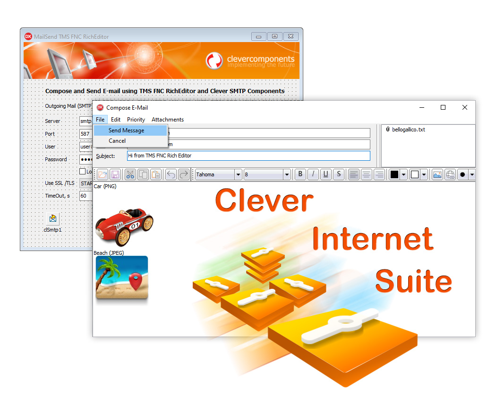

# MailSend with TMS FNC RichEditor

The MailSendTMSRichEditor project is a code example for the [MailSend with TMS FNC RichEditor](https://www.clevercomponents.com/portal/kb/a178/mail-send-with-tms-fnc-richeditor.aspx) tutorial.

This Delphi program demonstrates how to use TMS FNC UI RichEditor component together with Clever Internet Suite SMTP and MailMessage components to compose and send HTML emails with rich text formatting, attachments, and embedded images.

## Overview

This tutorial demonstrates how to:

- **Compose Rich HTML Emails**: Use TMS FNC RichEditor for WYSIWYG email composition with formatting
- **Send Emails via SMTP**: Send composed emails using TclSmtp component from Clever Internet Suite
- **Build MIME Messages**: Create complete MIME-formatted emails with TclMailMessage component
- **Handle Attachments**: Add and manage file attachments to emails
- **Extract Text from HTML**: Convert HTML content to plain text using TclHtmlParser
- **Embed Images**: Handle embedded images in HTML emails
- **Support Authentication**: Use various SMTP authentication methods
- **Enable SSL/TLS**: Secure email transmission with SSL/TLS encryption

## Features

- **Rich Email Composition**: Full-featured HTML editor with formatting capabilities
- **SMTP Client Implementation**: Complete email sending functionality using TclSmtp
- **MIME Message Building**: Proper email formatting with TclMailMessage
- **Attachment Management**: Add, remove, and save file attachments
- **HTML to Text Conversion**: Extract plain text from HTML content
- **Image Embedding**: Support for embedded images in HTML emails
- **Multiple Authentication Methods**: Support for username/password, OAUTH2.0, NTLM, etc.
- **SSL/TLS Support**: Secure email transmission with encryption
- **Priority Settings**: Set email priority (High, Normal, Low)
- **CC/BCC Support**: Send copies to multiple recipients

---

## 🔔 Get Updates

We publish practical integration examples and technical guides for Clever Components products.

If you'd like to receive updates when new tutorials and component examples are released, you can subscribe here:

👉 https://www.clevercomponents.com/home/maillist.asp

---

## Components Used

### Clever Internet Suite Components:
- **TclSmtp**: SMTP client component for sending emails
- **TclMailMessage**: Email message component for creating MIME-formatted emails
- **TclHtmlParser**: HTML parser component for extracting text from HTML content

### TMS FNC UI Pack Components:
- **TTMSFNCRichEditor**: Rich text editor component for WYSIWYG email composition
- **TTMSFNCRichEditorHTMLIO**: HTML import/export for the rich editor
- **TTMSFNCRichEditorEditToolBar**: Editing toolbar for the rich editor
- **TTMSFNCRichEditorFormatToolBar**: Formatting toolbar for the rich editor

## Usage

1. **Configure SMTP Settings**:
   - Enter SMTP server address and port
   - Provide username and password for authentication
   - Select TLS mode (None, Explicit, Implicit)
   - Adjust timeout settings as needed

2. **Compose Email**:
   - Click "Compose and Send" button
   - Enter recipient addresses in To, CC, and BCC fields
   - Add subject line
   - Use rich editor to compose email body with formatting
   - Set email priority if needed

3. **Add Attachments**:
   - Click "Add File" to attach files
   - View attached files in the attachments list
   - Remove or save attachments as needed

4. **Send Email**:
   - Click "Send" to send the composed email
   - The application converts HTML to plain text
   - Builds MIME message with both HTML and text parts
   - Sends via SMTP with configured settings

## Application Scenarios

- **Email Clients**: Build desktop email client applications
- **Newsletter Senders**: Create applications for sending HTML newsletters
- **Customer Support Systems**: Implement email sending in support applications
- **Marketing Tools**: Create tools for sending marketing emails
- **Notification Systems**: Build systems for sending formatted notifications
- **Email Automation**: Automate email sending with rich formatting
- **Educational Tools**: Teach email composition and sending concepts

## Prerequisites

Before running this tutorial, ensure you have:

1. **Clever Internet Suite** (version 12 or compatible) installed
2. **TMS FNC UI Pack** installed (for rich editor functionality)
3. **Delphi 10.1 Berlin or later** (TMS FNC components require Delphi 10.1+)
4. Windows compatible operating system

**Note**: This example uses TMS FNC RichEditor component which requires TMS FNC UI Pack library. The TMS FNC UI Pack officially supports Delphi 10.1 Berlin and later versions. Alternative rich editor components can be used with similar functionality.

## Compilation Instructions

1. Clone the repository from [GitHub/CleverComponents/Clever-Internet-Suite-Tutorials](https://github.com/CleverComponents/Clever-Internet-Suite-Tutorials)
2. Download and install [Clever Internet Suite](https://www.clevercomponents.com/downloads/inetsuite/suitedownload.asp)
3. Download and install [TMS FNC UI Pack](https://www.tmssoftware.com/site/tmsfncuipack.asp) (requires Delphi 10.1+)
4. Open the MailSendTMSRichEditor.dproj project in your Delphi IDE
5. Compile and run the application

## Key Features Demonstrated

1. **Rich Email Composition**: Integration of third-party rich editor with email components
2. **HTML/Text Conversion**: Automatic extraction of plain text from HTML content
3. **Attachment Handling**: Complete attachment management workflow
4. **MIME Message Building**: Proper construction of multipart MIME messages
5. **SMTP Protocol**: Full SMTP client implementation with authentication
6. **Temporary File Management**: Proper handling of temporary files for attachments and HTML

## Integration Benefits

- **User-Friendly Interface**: Rich editor provides familiar word processor-like interface
- **Professional Email Formatting**: Support for fonts, colors, styles, and layouts
- **Reliable Email Sending**: Robust SMTP implementation with error handling
- **Standards Compliance**: Proper MIME formatting for email compatibility
- **Security**: Support for modern authentication and encryption methods

## Related Examples

- [GMail SMTP Client](https://github.com/CleverComponents/Clever-Internet-Suite-Examples/tree/master/Delphi/GMailSMTP): Example using OAUTH2.0 authentication with GMail
- [SMTP Client SSL](https://github.com/CleverComponents/Clever-Internet-Suite-Examples/tree/master/Delphi/SmtpClientSSL): Example demonstrating SSL/TLS connections to mail servers
- [MailMessage Umlauts](https://github.com/CleverComponents/Clever-Internet-Suite-Tutorials/tree/master/vcl/MailMessageUmlauts): Example handling international characters in emails

## Repository

The [GitHub/CleverComponents/Clever-Internet-Suite-Tutorials](https://github.com/CleverComponents/Clever-Internet-Suite-Tutorials) repository contains a collection of examples, code snippets, and demo projects.

It is updated periodically with new integration scenarios and component examples.
