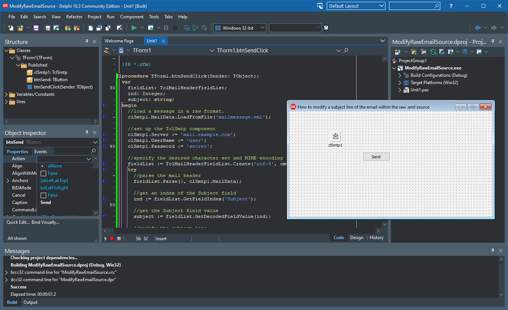

# How to modify a subject line of the email within the raw .eml source

The ModifyRawEmailSource project represents a code example for the [How to modify a subject line of the email within the raw source](https://www.clevercomponents.com/portal/kb/a133/how-to-build-and-parse-a-json-string-with-objects.aspx) tutorial.   

This tutorial loads an email message from an .eml file, parses the MIME message header, extracts and replaces the subject line, and finally, sends the message using the SMTP component.   
The other MIME header fields can be modified using the introduced approach.   

See also:   
[How to extract/add MIME headers in E-mail messages and HTTP requests](https://www.clevercomponents.com/portal/kb/a126/how-to-extract-add-mime-headers-in-e-mail-messages-and-http-requests.aspx)   

The [GitHub/CleverComponents/Clever-Internet-Suite-Tutorials](https://github.com/CleverComponents/Clever-Internet-Suite-Tutorials) repository represents a list of examples, code snippets and demo projects for the [Clever Internet Suite Tutorials](https://www.clevercomponents.com/articles/article035/) article. This list will be periodically updated, new projects will be added.   
Please stay tuned to new examples and use cases of the [Clever Internet Suite](https://www.clevercomponents.com/products/inetsuite/) library.
