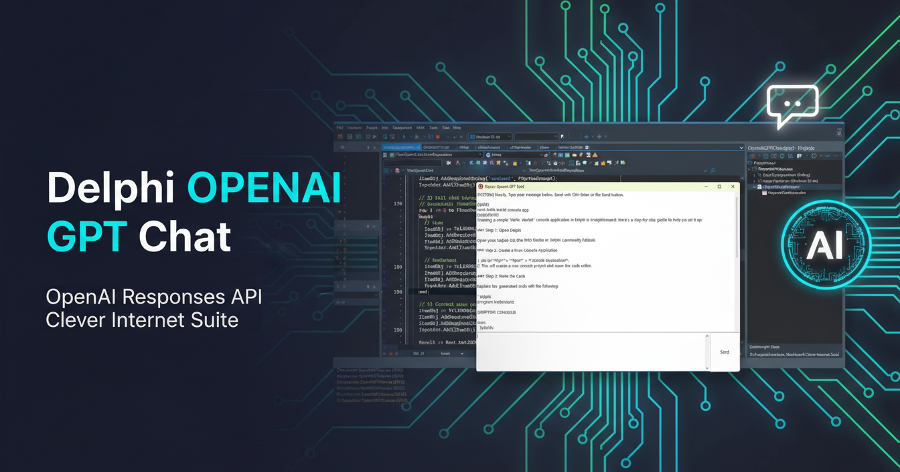

# Delphi OpenAI GPT Chat

This project demonstrates how to build a simple **Chat-style desktop application in Delphi** using the **OpenAI Responses API** and **Clever Internet Suite** components.




The example shows how to:
- send chat requests to OpenAI using `TclHttp` and `TclHttpRequest`
- build JSON requests with `TclJSONObject`
- parse complex Responses API output structures
- maintain full chat context across multiple requests
- implement a basic chat UI with VCL

The project is intended as a **reference and learning example** for Delphi developers.

## Overview

The OpenAI **Responses API** is more flexible than the legacy Chat Completions API and returns structured output that may include multiple content blocks and events. This demo application implements:

- A classic chat flow (`system → user → assistant`)
- Full conversation history preservation
- Correct parsing of `output[]` / `content[]` blocks
- A simple, readable VCL UI

No background services, threads, or streaming are used — the focus is on **clarity and correctness**.

## Usage

1. **Prepare configuration**: Create an INI file named `OpenAIGPTChat.ini` next to the executable with your OpenAI API key:
   ```ini
   [OpenAI]
   ApiKey=sk-proj-...
   ```
   ⚠️ **Important**: Do not commit real API keys to public repositories.

2. **Build and run**: Open the project in Delphi, build and run the application.

3. **Start chatting**: 
   - Type your message in the bottom memo control
   - Press **Ctrl+Enter** or click the **Send** button
   - The assistant's reply will appear in the chat history

4. **Chat context**: The full conversation history is maintained and sent with each request.

## Chat Context Handling

This example implements a **proper chat context model**:

- The full conversation history is sent on each request
- Messages are ordered strictly as: `system → user → assistant → user → assistant → ... → user (current)`
- Two `TStringList` instances are used: one for user prompts and one for assistant replies
- This approach is easy to understand for Delphi developers and safe for multi-line messages

## Application Scenarios

This example is designed for:

- Learning OpenAI Responses API concepts in Delphi
- Reference implementation for Delphi developers integrating with AI APIs
- Experimenting with chat-based AI features in desktop applications
- Adapting into larger Delphi applications with AI capabilities
- Educational purposes for understanding JSON API integration

**Note**: This is not intended as a production-ready chat client without further enhancements such as context size limiting, summarization, streaming responses, or background threading.

## Requirements

- **Delphi**: Delphi 2009 or later (Unicode support required)
- **Clever Internet Suite**: Version 11 or later
- **Windows**: Windows 7 or later
- **Internet connection**: Required for API access to `api.openai.com`
- **OpenAI API key**: Valid API key from OpenAI

**Note**: The project was compiled with Clever Internet Suite version 12. Tutorials and project files for previous versions can be found in the [Releases](https://github.com/CleverComponents/Clever-Internet-Suite-Tutorials/releases) section.

## TLS Compatibility Note

Previous versions of **Clever Internet Suite** may experience issues with TLS 1.3 when connecting to `api.openai.com`. For compatibility, this demo explicitly disables automatic system TLS negotiation:

```pascal
Http.UseSystemTLSFlags := False;
```

This forces a stable TLS 1.2 connection and prevents connection timeouts in certain environments.

## Error Handling

- HTTP status codes are checked explicitly (400+ codes are treated as errors)
- `SilentHTTP` is enabled to allow reading error responses from the API
- Raw JSON responses are logged in the chat display on error for debugging
- Internal consistency checks protect chat history integrity

## Related Examples

- [How to send a GET request with JSON data](https://github.com/CleverComponents/Clever-Internet-Suite-Tutorials/tree/master/vcl/SendJSonGetRequest) - This tutorial demonstrates how to create and send JSON requests using Clever Internet Suite.
- [How to Build and Parse a JSON String with Objects](https://github.com/CleverComponents/Clever-Internet-Suite-Tutorials/tree/master/vcl/BuildParseJSON) - This tutorial makes a JSON request, which includes objects and object properties. It also includes code, which parses received JSON response and extracts all included object properties.

## Repository

The [GitHub/CleverComponents/Clever-Internet-Suite-Tutorials](https://github.com/CleverComponents/Clever-Internet-Suite-Tutorials) repository contains a collection of examples, code snippets, and demo projects for the [Clever Internet Suite Tutorials](https://www.clevercomponents.com/articles/article035/). It will be updated periodically with new projects.

Stay tuned for new examples and use cases of the [Clever Internet Suite](https://www.clevercomponents.com/products/inetsuite/) library.