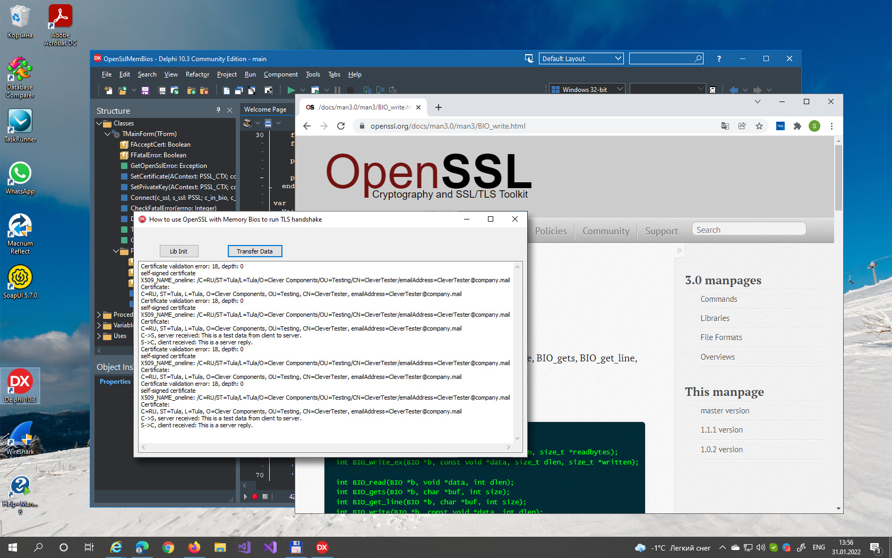

# How to use OpenSSL with Memory Bios to run TLS handshake

This simple Delphi project represents my experience in implementing the in-memory TLS handshake using OpenSSL 3.0. There are lots of examples with previous versions of the library on the Internet. So I decided to share this project to help other developers to get started with OpenSSL memory BIOs in Delphi. I'm still working on this test project. So if you find any errors or have questions, do not hesitate to contact me.
Also, please feel free to star the repo to help other devs to find this project!

The main our task was to implement a cross-platform version of our Delphi components. Currently the components use Microsoft Schannel and CryptoAPI to implement TLS and other crypthographic features.

I worked with MS Schannel, SSPI, and CryptoAPI for many years and familiar with many tricks, problems, and use-cases. But OpenSSL become a real challenge for me. I know anough about SSL/TLS internals, and this helped me a lot.

I found many examples of using OpenSSL 1xx and earlier on the Internet. But since the main requirement was to use the latest version 3.0, I have to use the official documentation https://www.openssl.org/docs/man3.0/man3/ and debug the code in a test Delphi app.
The other resources were helped me a lot to get started. Many thanks to the authors:
[Using OpenSSL with memory BIOs](https://www.roxlu.com/2014/042/using-openssl-with-memory-bios), [Getting started with OpenSSL: Cryptography basics](https://opensource.com/article/19/6/cryptography-basics-openssl-part-1)
and many others.

The code might look a bit superflow and have some unnecessary function calls. This is because I needed to test the OpenSSL behavior for the purposes of our Delphi components. Please check out the comments in the sources for more details.

If you want to investigate the TLS handshake packets using a Network traffic analyzer, e.g. WireShark, you can compile the project with the SENDPACKETS compiler conditional define. This will add a code that sends the produced packets over the Internet. Please check out the other project for more details [Silent Socket Receiver in Delphi](https://github.com/CleverComponents/Clever-Internet-Suite-Tutorials/tree/master/vcl/SilentSocketReceiver).

Just clone the [GitHub/CleverComponents/Clever-Internet-Suite-Tutorials](https://github.com/CleverComponents/Clever-Internet-Suite-Tutorials) repository, open, and compile the OpenSslMemBios.dproj project in your Delphi IDE.

Please feel free to [Contact Me](https://www.clevercomponents.com/support/) and ask any program related questions.   

Keep updated on [Facebook](http://www.facebook.com/clevercomponents)   [YouTube](https://www.youtube.com/channel/UC9Si4WNQVSeXQMjdEJ8j1fg)   [Twitter](https://twitter.com/CleverComponent)   [Telegram](https://t.me/clevercomponents)   [Newsletter](https://www.clevercomponents.com/home/maillist.asp)   
