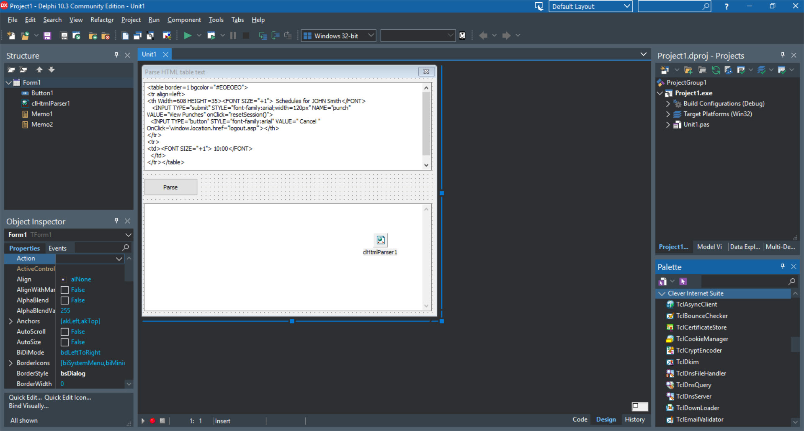

# Parse HTML Table Text

The ParseTableCellValues project is a code example for the [Parse HTML table text](https://www.clevercomponents.com/portal/kb/a59/parse-html-table-text.aspx) tutorial.

This tutorial demonstrates how to use the `TclHtmlParser` component from Clever Internet Suite to parse HTML documents, extract tables, and retrieve text content from individual table cells.

## Overview

This tutorial shows how to:

- **Parse HTML Content**: Load and parse HTML documents using the `TclHtmlParser` component.
- **Extract Table Structures**: Access HTML table elements, rows, and cells from the parsed document.
- **Retrieve Cell Text**: Extract and clean text content from individual table cells, handling nested HTML tags.
- **Navigate HTML DOM**: Traverse through the parsed HTML document structure to locate specific elements.

This example focuses specifically on table extraction but demonstrates the broader capability of the HTML parser to work with complex HTML structures.

---

## 🔔 Get Updates

We publish practical integration examples and technical guides for Clever Components products.

If you'd like to receive updates when new tutorials and component examples are released, you can subscribe here:

👉 https://www.clevercomponents.com/home/maillist.asp

---

## Features

- **HTML Table Parsing**: Extract complete table structures from HTML documents.
- **Cell Text Extraction**: Retrieve clean text content from table cells, stripping HTML tags.
- **DOM Navigation**: Traverse through tables, rows, and cells in a structured manner.
- **HTML Tag Handling**: Properly handle nested HTML tags within table cells.
- **Simple Interface**: Easy-to-use demonstration with input and output memo controls.
- **Robust Parsing**: Handle various HTML table formats and structures.

## Components Used

### Clever Internet Suite Components:
- **`TclHtmlParser`**: Core component for parsing HTML documents and extracting structured content.

## Usage

1. **Prepare HTML Content**:
   - Enter or paste HTML content containing tables into the left memo (`Memo1`).
   - Ensure the HTML includes `<table>` elements with proper structure.

2. **Parse and Extract**:
   - Click the "Parse" button (`Button1`).
   - The application parses the HTML content and extracts all table structures.

3. **View Results**:
   - The right memo (`Memo2`) displays the extracted content:
     - Each table is identified with "table X" header.
     - Each row within tables is marked with "row Y".
     - Individual cell text content is listed below each row header.

## Application Scenarios

- **Web Scraping**: Extract tabular data from web pages for analysis or storage.
- **Data Migration**: Convert HTML tables to structured formats (CSV, database, etc.).
- **Content Analysis**: Analyze and process HTML content programmatically.
- **Report Generation**: Extract data from HTML reports for further processing.
- **Email Processing**: Parse HTML email content to extract tabular information.
- **Testing Tools**: Verify HTML table structures in web applications.
- **Data Mining**: Collect structured data from multiple HTML sources.

## Requirements

- **Delphi Version**: Delphi 7 or later (code is compatible with both non-Unicode and Unicode versions).
- **Clever Internet Suite**: Version 12.0 or compatible.
- **Prerequisites**: Basic understanding of HTML table structure (`<table>`, `<tr>`, `<td>` tags).

## Key Implementation Details

1. **Parser Configuration**: The `ParseMethod` property is set to `pmAll` to ensure complete parsing of all HTML elements.
2. **Table Traversal**: 
   - Iterate through `clHtmlParser1.Tables` collection to access each table.
   - For each table, iterate through `table.Rows` collection.
   - For each row, iterate through `row.Cells` collection.
3. **Text Extraction**: The `GetCellText` method extracts text content from cells by:
   - Iterating through all tags within a cell.
   - Checking if each tag contains text (`IsText` property).
   - Concatenating all text content and trimming whitespace.
4. **Output Formatting**: Results are displayed in a hierarchical format showing table and row relationships.

## Code Structure

- `Button1Click`: Main procedure that triggers HTML parsing and table extraction.
- `GetCellText`: Helper function that extracts clean text from a table cell by processing nested tags.
- The parsing process preserves the original HTML structure while making text content accessible.

## Related Resources

- [HTML Parsing Examples](https://github.com/CleverComponents/Clever-Internet-Suite-Examples/tree/master/Delphi/HtmlParser) - Additional examples of HTML parsing capabilities.

## Repository

The [GitHub/CleverComponents/Clever-Internet-Suite-Tutorials](https://github.com/CleverComponents/Clever-Internet-Suite-Tutorials) repository contains a collection of examples, code snippets, and demo projects.

It is updated periodically with new integration scenarios and component examples.
