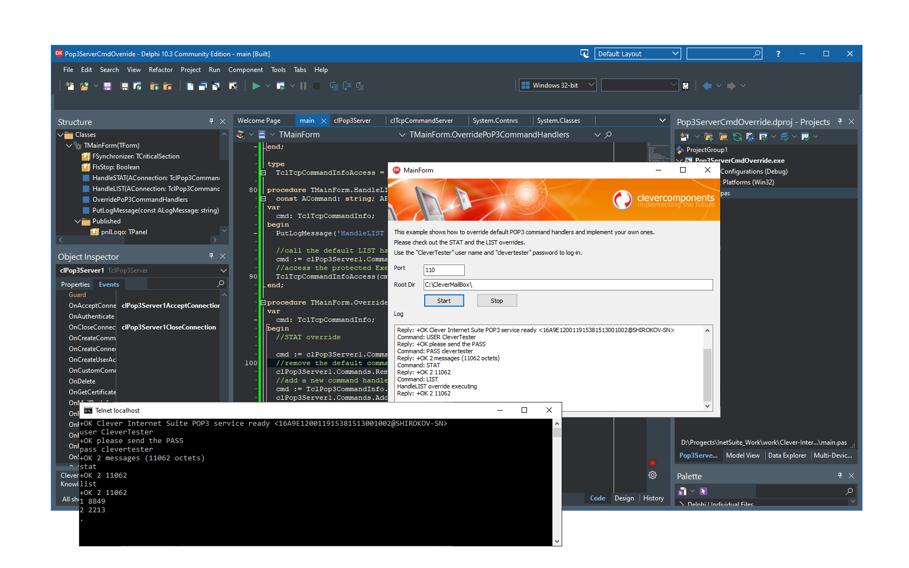

# How to Override Default POP3 Server Command Handlers

This Delphi VCL example demonstrates how to customize POP3 server command handlers using Clever Internet Suite components.

## Overview
This example shows:
- How to create a POP3 server using TclPop3Server component
- How to override default POP3 command handlers (STAT and LIST)
- How to use TclPop3FileHandler for file-based mailbox storage
- How to implement custom POP3 command logic

## Features
- Uses TclPop3Server component for POP3 protocol implementation
- Uses TclPop3FileHandler component for message storage
- Demonstrates command handler overriding technique
- Supports POP and SASL authentication methods (LOGIN, CRAM-MD5, NTLM)
- Shows multithreaded server capabilities

## Usage
1. Open the project in Delphi IDE
2. Ensure Clever Internet Suite is installed
3. Set the mailbox directory path
4. Configure server port (default: 110)
5. Start the server
6. Connect using any POP3 client with credentials:
   - Username: CleverTester
   - Password: clevertester

## Application Scenarios
This example is useful for:
- Building custom POP3 servers with specialized behavior
- Learning POP3 protocol implementation
- Creating mail server applications with custom commands
- Testing POP3 client applications

## Requirements
- **Delphi:** 7 or higher
- **Clever Internet Suite:** version 12 or higher

The project was compiled with Clever Internet Suite version 12.  
Tutorials and project files for previous versions of Clever Internet Suite can be found in the [Releases](https://github.com/CleverComponents/Clever-Internet-Suite-Tutorials/releases) section.

## Compilation Instructions
1. Clone the [GitHub/CleverComponents/Clever-Internet-Suite-Tutorials](https://github.com/CleverComponents/Clever-Internet-Suite-Tutorials) repository
2. Download and install [Clever Internet Suite](https://www.clevercomponents.com/downloads/inetsuite/suitedownload.asp)
3. Open the Pop3ServerCmdOverride.dproj project in Delphi IDE
4. Compile and run the application

## Related Examples
- [Clever Mail Server](https://github.com/CleverComponents/Clever-Mail-Server): Complete mail server implementation

## Repository
The [GitHub/CleverComponents/Clever-Internet-Suite-Tutorials](https://github.com/CleverComponents/Clever-Internet-Suite-Tutorials) repository contains a collection of examples, code snippets, and demo projects for the [Clever Internet Suite Tutorials](https://www.clevercomponents.com/articles/article035/). It will be updated periodically with new projects.

Stay tuned for new examples and use cases of the [Clever Internet Suite](https://www.clevercomponents.com/products/inetsuite/) library.