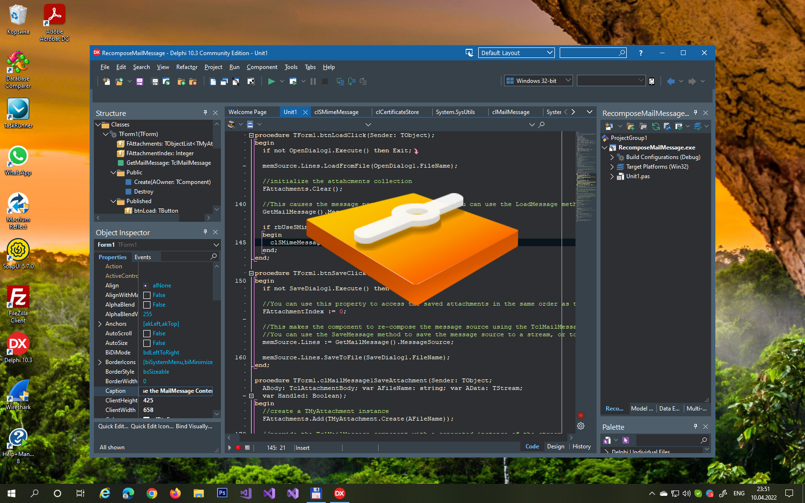

# Recompose Mail Message with Attachments

This Delphi application demonstrates how to work with email messages containing attachments using the Clever Internet Suite components. The program utilizes the TclMailMessage and TclSMimeMessage components to parse and compose email messages in MIME format with file or image attachments.

## Overview

When using the [TclMailMessage](https://www.clevercomponents.com/products/inetsuite/messageparser.asp) component with POP3 or IMAP4 clients, message parts are extracted and saved to the MailMessage object's properties. If you save the message source using the `TclMailMessage.SaveMessage` method or access it via the `TclMailMessage.MessageSource` property, the message is recomposed. Since attachments are not stored in memory, the component raises the `OnLoadAttachment` event to obtain a stream with the attachment content. As a result, you will not get the original message content. To obtain the original source of the received message, please use the `TclPop3.Response` (or `TclImap4.Response`) property instead. Otherwise, you need to implement both the `TclMailMessage.OnSaveAttachment` and `TclMailMessage.OnLoadAttachment` event handlers. This program demonstrates how to accomplish this.

The [TclSMimeMessage](https://www.clevercomponents.com/products/inetsuite/smimeparser.asp) component, which inherits from TclMailMessage, provides additional functionality to encrypt/decrypt and sign/verify messages using the S/MIME standard.

This application uses both components and also allows saving digitally signed/verified message sources. The source code comments will help you understand how the code works.

Using this tutorial as a starting point, you can implement your own storage for attached files and images, including database tables and in-memory streams.

## Features
- Parse and compose email messages in MIME format
- Handle file and image attachments in memory streams
- Support for S/MIME digital signatures and encryption
- Custom attachment storage implementation
- Event-driven attachment loading and saving
- Message source reconstruction capabilities

## Usage
1. Select message type (Standard Mail Message or S/MIME)
2. Click "Create Message" to generate a sample message with attachments
3. Save the message to a file
4. Load previously saved messages to verify reconstruction
5. Use S/MIME option for signed/encrypted messages

## Application Scenarios
- Email client development with attachment handling
- Message archiving systems preserving original content
- Email processing applications requiring message reconstruction
- Secure email applications with S/MIME support
- Database storage of email messages with attachments
- Email migration tools preserving message integrity

## Requirements
- **Delphi**: Delphi 2009 or higher (for Unicode support)
- **Clever Internet Suite**: version 12 or higher

The project was compiled with Clever Internet Suite version 12. Tutorials and project files for previous versions can be found in the [Releases](https://github.com/CleverComponents/Clever-Internet-Suite-Tutorials/releases) section.

## Related Examples
- [Saving mail attachments](https://www.clevercomponents.com/portal/kb/a33/saving-mail-attachments.aspx)
- [Sending Mail with Attachments from Memory Stream](https://www.clevercomponents.com/portal/kb/a121/sending-mail-with-attachments-from-memory-stream.aspx)
- [Adding text and attachments to the E-mail message](https://www.clevercomponents.com/portal/kb/a124/adding-text-and-attachments-to-the-e-mail-message.aspx)

## Repository
The [GitHub/CleverComponents/Clever-Internet-Suite-Tutorials](https://github.com/CleverComponents/Clever-Internet-Suite-Tutorials) repository contains a collection of examples, code snippets, and demo projects for the [Clever Internet Suite Tutorials](https://www.clevercomponents.com/articles/article035/). It will be updated periodically with new projects.

Stay tuned for new examples and use cases of the [Clever Internet Suite](https://www.clevercomponents.com/products/inetsuite/) library.