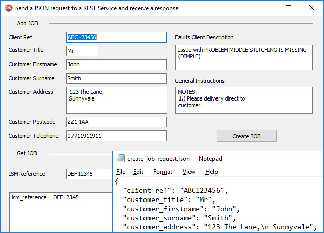

# How to write a REST client with JSON in Delphi

The RestClientSendReceiveJson project represents a code example for the [How to write a REST client with JSON in Delphi](https://www.clevercomponents.com/portal/kb/a135/how-to-write-a-rest-client-with-json-in-delphi.aspx) tutorial.

This tutorial demonstrates how to create a REST API client in Delphi that communicates with web services using JSON format. The example uses JSONPlaceholder - a free fake online REST API for testing and prototyping.



## Overview

This tutorial demonstrates how to use Clever Internet Suite components to:

- Create and send JSON requests to REST API endpoints
- Handle GET and POST HTTP methods with JSON data
- Parse JSON responses with nested objects and arrays
- Extract and display specific data from JSON structures
- Handle HTTP errors and status codes
- Work with different JSON data types

---

## 🔔 Get Updates

We publish practical integration examples and technical guides for Clever Components products.

If you'd like to receive updates when new tutorials and component examples are released, you can subscribe here:

👉 https://www.clevercomponents.com/home/maillist.asp

---

## Important Configuration Notes

**This example is pre-configured to work with JSONPlaceholder**, a free fake online REST API. It demonstrates the concepts but uses a simplified JSON structure.

**To use with your own API**, you need to:

1. **Update the Base URL** in `FormCreate` method:
   ```delphi
   // Change from:
   FBaseURL := 'https://jsonplaceholder.typicode.com';
   // To your API endpoint:
   FBaseURL := 'https://your-api-domain.com';
   ```

2. **Update JSON structure** to match your API:
   - Modify the JSON objects created in `btnCreateJobClick` to match your API's request format
   - Update JSON parsing in `btnGetJobDetailsClick` to handle your API's response structure
   - Adjust field names, nested objects, and arrays according to your API specifications

3. **Set Authentication** if required by your API by configuring the authorization header in the `SendJSONRequest` method.

## Features

- **JSON Request Building**: Create JSON requests from form data using TclJSONObject
- **REST API Communication**: Send requests and receive responses using TclHttp component
- **JSON Response Parsing**: Parse and navigate JSON response structures
- **Error Handling**: Handle HTTP errors and status codes
- **Data Display**: Display parsed JSON data in readable format
- **HTTP Method Support**: Support for GET (retrieve data) and POST (create data) operations

## Usage with JSONPlaceholder (Demo Mode)

1. **Get Post Details**:
   - Enter a post ID (1-100) in the "Post ID" field
   - Click "Get Demo Post" button
   - The application sends a GET request to JSONPlaceholder
   - Parsed post details display in the results memo

2. **Create New Post**:
   - Fill in title and body text in the form fields
   - Click "Create Demo Post" button
   - The application sends a POST request to JSONPlaceholder
   - Success response displays the new post ID

## Real API Integration

For production use with your own API, update the code to:
- Use your actual API endpoint URL
- Match the JSON structure expected by your API
- Configure appropriate authentication
- Handle your specific error response format
- Parse the hierarchical data structure returned by your API

## Application Scenarios

- **API Integration**: Connect Delphi applications to RESTful web services
- **Data Exchange**: Send and receive structured data in JSON format
- **Service Consumption**: Consume third-party APIs in desktop applications
- **Prototyping**: Quickly prototype API integrations
- **Testing**: Test API connectivity and data parsing

## Implementation Details

### JSON Request Building
The example uses TclJSONObject to construct JSON requests with methods for adding different data types.

### HTTP Communication
TclHttp.SendRequest method handles HTTP communication with a unified interface for all HTTP methods (GET, POST, PUT, DELETE).

### JSON Response Processing
TclJSONObject.ParseObject parses JSON responses, and various methods extract specific data from the parsed structure.

### Error Handling
HTTP status codes are checked, and errors are displayed with descriptive messages. 

**Important**: To enable handling HTTP status codes (like 400, 404, 500) without raising exceptions, the `SilentHTTP` property must be set to `True`. When `SilentHTTP` is `False`, the TclHttp component raises exceptions for non-success HTTP status codes, preventing normal error handling flow.

## Advantages of Using Clever Internet Suite

1. **Simplified JSON Handling**: Easy-to-use classes for JSON creation and parsing
2. **Comprehensive HTTP Client**: Full-featured HTTP client with SSL/TLS support
3. **Unicode Support**: Full Unicode compatibility for international data
4. **Stream-Based Processing**: Efficient memory usage with stream-based operations
5. **Production Ready**: Robust error handling and connection management

## Requirements

- **Delphi 7 or later**
- **Clever Internet Suite 12** or compatible version
- **Internet connection** for API communication

The project was compiled with Clever Internet Suite version 12. Tutorials and project files for previous versions can be found in the [Releases](https://github.com/CleverComponents/Clever-Internet-Suite-Tutorials/releases) section.

## Repository

The [GitHub/CleverComponents/Clever-Internet-Suite-Tutorials](https://github.com/CleverComponents/Clever-Internet-Suite-Tutorials) repository contains a collection of examples, code snippets, and demo projects.

It is updated periodically with new integration scenarios and component examples.
