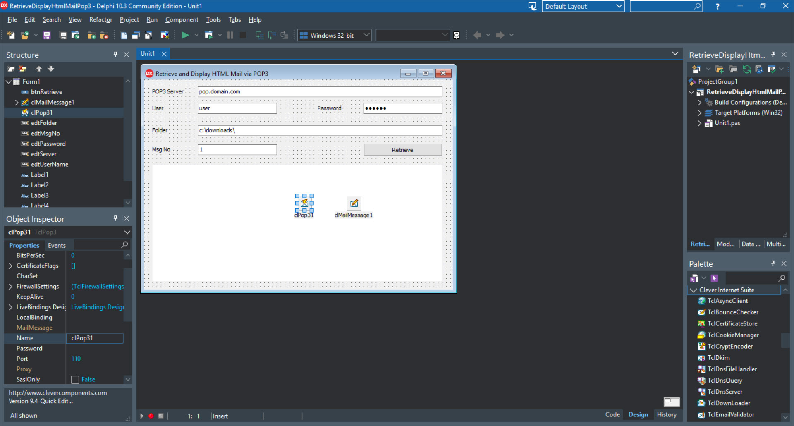

# Retrieve and Display HTML Mail via POP3

The RetrieveDisplayHtmlMailPop3 project represents a code example for the [Retrieve and Display HTML Mail via POP3](https://www.clevercomponents.com/portal/kb/a145/retrieve-and-display-html-mail-via-pop3.aspx) tutorial.

This tutorial demonstrates how to create a POP3 client application that downloads a selected email message from a POP3 mailbox, extracts MIME message parts, and displays the message content. If the message includes an HTML part, it is displayed using the TWebBrowser component; otherwise, a text part is shown.

## Overview

This tutorial demonstrates how to:

- Connect to a POP3 server and authenticate using user credentials
- Retrieve a specific email message by its index
- Parse MIME message structure and extract different body parts
- Handle HTML messages with embedded images using Content-ID references
- Save attachments and images to local folders with unique filenames
- Display HTML content in a TWebBrowser control
- Manage file operations and directory creation

## Features

- **POP3 Client Implementation**: Full POP3 protocol support using `TclPop3` component
- **MIME Message Parsing**: Automatic parsing of multipart email messages with `TclMailMessage`
- **HTML Rendering**: Display of HTML messages with embedded images via TWebBrowser
- **Attachment Handling**: Save attachments and images to disk with automatic duplicate resolution
- **File Management**: Utility functions for directory creation and file operations
- **Error Handling**: Robust exception handling for network and file operations

## Usage

1. **Configure Connection**:
   - Enter POP3 server address (e.g., pop.domain.com)
   - Provide username and password for authentication
   - Specify local folder path for saving attachments

2. **Retrieve Message**:
   - Enter message number to download
   - Click "Retrieve" button to fetch and parse the message

3. **View Results**:
   - HTML messages display in the embedded browser
   - Text messages show in message text format
   - Attachments save to specified local folder

## Application Scenarios

- **Email Client Development**: Building custom email clients with HTML support
- **Message Archiving**: Downloading and storing email messages with attachments
- **Content Extraction**: Parsing and displaying email content in applications
- **Automated Processing**: Scripted retrieval and processing of email messages
- **Debugging Tools**: Analyzing email structure and MIME formatting

## Requirements

- **Delphi 7** or later
- **Clever Internet Suite 12** or compatible version
- **Windows** operating system

The project was compiled with Clever Internet Suite version 12. Tutorials and project files for previous versions can be found in the [Releases](https://github.com/CleverComponents/Clever-Internet-Suite-Tutorials/releases) section.

## Repository

The [GitHub/CleverComponents/Clever-Internet-Suite-Tutorials](https://github.com/CleverComponents/Clever-Internet-Suite-Tutorials) repository contains a collection of examples, code snippets, and demo projects for the [Clever Internet Suite Tutorials](https://www.clevercomponents.com/articles/article035/). It will be updated periodically with new projects.

Stay tuned for new examples and use cases of the [Clever Internet Suite](https://www.clevercomponents.com/products/inetsuite/) library.