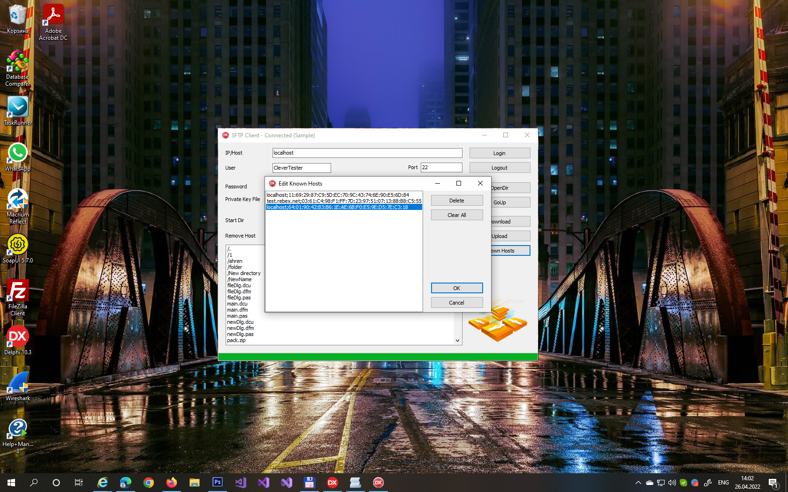

# SFTP Client with Host-key Repository

This project represents a code example for the [SFTP Client with Host-key Repository](https://www.clevercomponents.com/portal/kb/a191/sftp-client-with-host-key-repository.aspx) tutorial. It implements a simple host key repository that keeps all known and verified SFTP host keys and automatically accepts connections to these hosts.

## Overview
This Delphi application demonstrates the use of the `TclSFtp` component from the Clever Internet Suite library to connect to SFTP servers with enhanced security through host-key verification. The application maintains a repository of trusted host keys, preventing repetitive security prompts for known servers.

*   **Secure Connection**: Implements SSH protocol for secure file transfer.
*   **Host-key Verification**: Automatically verifies and trusts known SFTP servers using a local repository.
*   **Dual Authentication**: Supports both User/Password and Private Key authorization methods.
*   **File Operations**: Allows browsing directories, downloading, and uploading files.
*   **Repository Management**: Provides an interface to view and manage the list of trusted hosts.

## Features
*   Secure SFTP connections using the `TclSFtp` component.
*   Host-key verification with automatic acceptance of known hosts.
*   Persistent storage of trusted host information in `hostkeyrepository.txt`.
*   Support for both password-based and public key authentication.
*   Directory browsing with navigation (open directory, go up).
*   File download and upload operations with progress indication.
*   Management interface for the host-key repository.
*   Complete component documentation is available at [Clever Internet Suite Components](https://www.clevercomponents.com/products/inetsuite/components.asp)

## Usage
1.  Open the `SFtpClientHostKey.dproj` project in your Delphi IDE.
2.  Ensure the Clever Internet Suite components are installed and accessible.
3.  Build and run the application.
4.  Enter connection details (Host, Port, User, etc.) and select authentication method.
5.  Click **Login** to establish a connection. For new hosts, you will be prompted to verify and trust the server.
6.  Use the interface to browse directories, upload/download files, and manage the list of known hosts via the **Known Hosts** button.
7.  The application automatically saves trusted host information to `hostkeyrepository.txt` in the application directory.

**Note**: for testing purposes, you can use our example [SFTP server](https://github.com/CleverComponents/Clever-Internet-Suite-Examples/tree/master/Delphi/SFtpServer)

## Application Scenarios
*   Developing secure SFTP clients for corporate environments where connections to specific trusted servers are frequent.
*   Creating automated file transfer solutions that require minimal user interaction for known hosts.
*   Building SFTP management tools with enhanced security through host-key verification.
*   Learning how to implement persistent host-key storage in SFTP applications.

## Requirements
*   **Delphi**: Delphi 2009 or newer.
*   **Clever Internet Suite**: Version 10.0 or newer.
*   The project was compiled with Clever Internet Suite version 12. Tutorials and project files for previous versions can be found in the [Releases](https://github.com/CleverComponents/Clever-Internet-Suite-Tutorials/releases) section.

## Related Examples
*   [SFTP Client Example](https://github.com/CleverComponents/Clever-Internet-Suite-Examples/tree/master/Delphi/SFtpClient)
*   [SFTP Client with User and Public Key Authorization](https://github.com/CleverComponents/Clever-Internet-Suite-Tutorials/tree/master/SFtpClient)
*   [SFTP Server Example](https://github.com/CleverComponents/Clever-Internet-Suite-Examples/tree/master/Delphi/SFtpServer)

## Repository
The [GitHub/CleverComponents/Clever-Internet-Suite-Tutorials](https://github.com/CleverComponents/Clever-Internet-Suite-Tutorials) repository contains a collection of examples, code snippets, and demo projects for the [Clever Internet Suite Tutorials](https://www.clevercomponents.com/articles/article035/). It will be updated periodically with new projects.

Stay tuned for new examples and use cases of the [Clever Internet Suite](https://www.clevercomponents.com/products/inetsuite/) library.