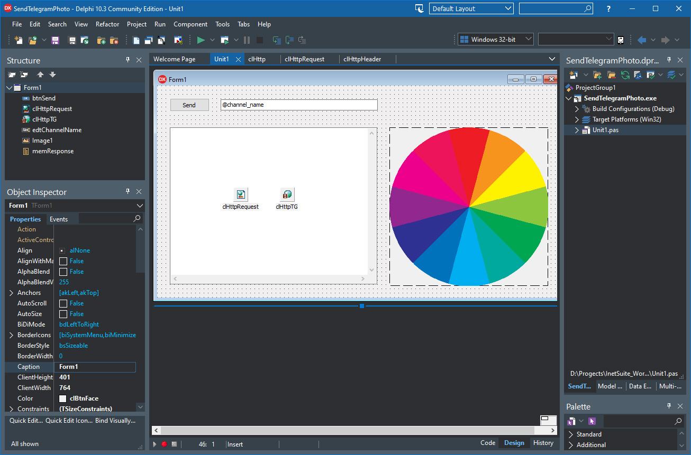

# Send Photo using Telegram API

The program represents a Delphi tutorial that utilizes the Clever HTTP and HttpRequest components to submit an image to a Telegram channel using [Telegram Bot API](https://core.telegram.org/bots/api)   

This Delphi program represents a mostly simple demos and by no means, a complete application. It's intended to demonstrate how to use the [HTTP Client](https://www.clevercomponents.com/products/inetsuite/httpclient.asp) together with the [HTTP Request](https://www.clevercomponents.com/products/inetsuite/requestbuilder.asp) component in your Delphi application.   

The program allows you to load an image using the TImage VCL component, save the image source in to a stream, and substitute the derived stream to the REST API request using the OnLoadData event of the HTTP Request component.   

The Clever HTTP components completely support SSL/TLS, custom HTTP headers, Form Field, JSON, and SOAP requests. The following example shows how to send JSON data to a REST service: [How to write a REST client with JSON in Delphi](https://github.com/CleverComponents/Clever-Internet-Suite-Tutorials/tree/master/vcl/RestClientSendReceiveJson)   

See also the [Delphi REST SOAP Client with WSS Signatures and Encryption](https://github.com/CleverComponents/Clever-Internet-Suite-Tutorials/tree/master/RestSoapSignEncrypt)

How to compile:   
1. Please clone the [GitHub/CleverComponents/Clever-Internet-Suite-Tutorials](https://github.com/CleverComponents/Clever-Internet-Suite-Tutorials) repository.
2. Download and install the [Clever Internet Suite](https://www.clevercomponents.com/downloads/inetsuite/suitedownload.asp) library.
3. Open and compile the SendTelegramPhoto project in your Delphi IDE.
4. Enjoy.

Please feel free to [Contact Us](https://www.clevercomponents.com/support/) and ask any program related questions.   

Keep updated on [Facebook](http://www.facebook.com/clevercomponents)   [YouTube](https://www.youtube.com/channel/UC9Si4WNQVSeXQMjdEJ8j1fg)   [Twitter](https://twitter.com/CleverComponent)   [Telegram](https://t.me/clevercomponents)   [Newsletter](https://www.clevercomponents.com/home/maillist.asp)   
