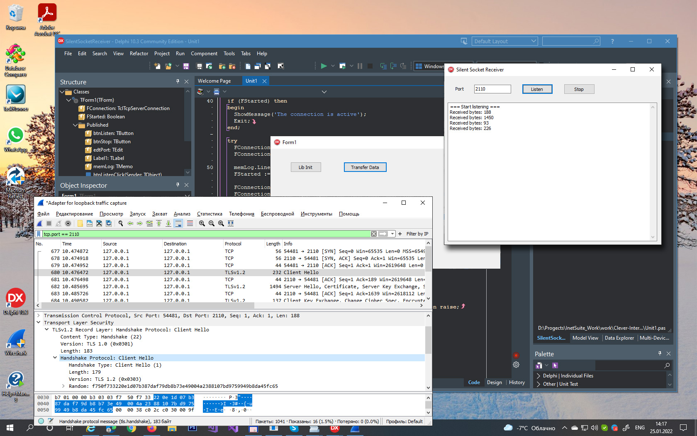

# Silent Socket Receiver in Delphi

The tutorial represents a Delphi program that starts listening to an incoming connection, accepts the connection, receives all data over the established connection, and sends no data back to the client.   

This Delphi program represents a mostly simple demos and by no means, a complete application. It's intended to demonstrate how to use the TcpServerConnection socket class from the [Clever Internet Suite](https://www.clevercomponents.com/products/inetsuite/) library to start listening on the specified local port and receive TCP packets over the Network.  

This functionality might be useful when you debug a Network app and want to analyze the produced TCP traffic. You can run the Silent Socket Receiver app and capture the Network packets between the client and the server, e.g. using the [Wireshark](https://www.wireshark.org/download.html) utility. In this case your Network app acts as the client, and the Silent Socket Receiver app as the server.   

You can even modify the Silent Socket Receiver program to send TCP response back to the connected client.   

See also the [TCP client / server connection](https://github.com/CleverComponents/Clever-Internet-Suite-Tutorials/tree/master/vcl/CustomSocket) project and the [Read a fixed number of bytes from the socket using TcpClientConnection](https://www.clevercomponents.com/portal/kb/a96/read-a-fixed-number-of-bytes-from-the-socket-using-tcpclientconnection.aspx) article.

How to compile:   
1. Please clone the [GitHub/CleverComponents/Clever-Internet-Suite-Tutorials](https://github.com/CleverComponents/Clever-Internet-Suite-Tutorials) repository.
2. Download and install the [Clever Internet Suite](https://www.clevercomponents.com/downloads/inetsuite/suitedownload.asp) library.
3. Open and compile the SilentSocketReceiver project in your Delphi IDE.
4. Enjoy.

Please feel free to [Contact Us](https://www.clevercomponents.com/support/) and ask any program related questions.   

Keep updated on [Facebook](http://www.facebook.com/clevercomponents)   [YouTube](https://www.youtube.com/channel/UC9Si4WNQVSeXQMjdEJ8j1fg)   [Twitter](https://twitter.com/CleverComponent)   [Telegram](https://t.me/clevercomponents)   [Newsletter](https://www.clevercomponents.com/home/maillist.asp)   
