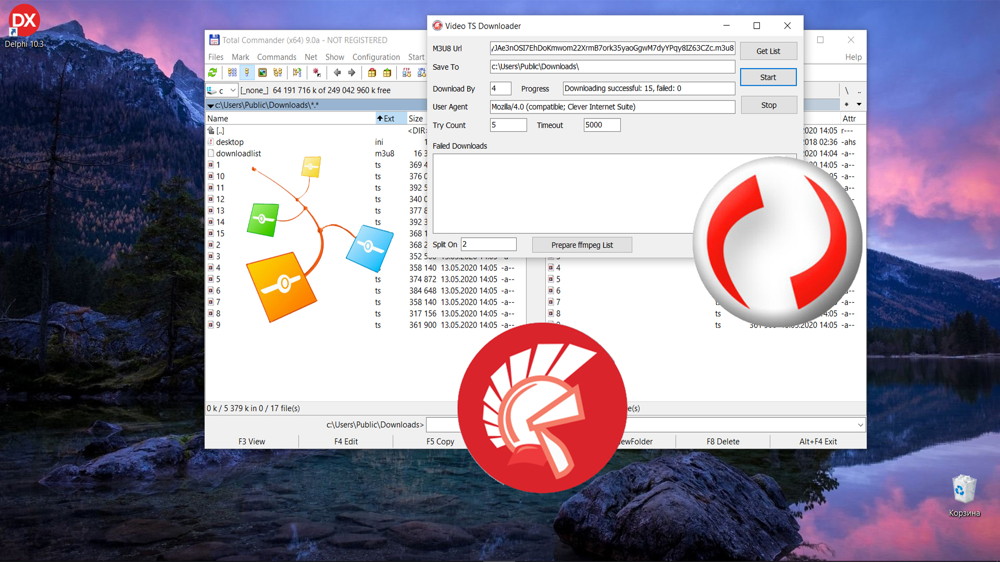

# Download TS files from video stream

This Delphi example demonstrates how to download Transport Stream (.ts) video segment files from an M3U8 playlist using the Clever Internet Suite library. The application implements a complete HLS (HTTP Live Streaming) downloader with parallel downloads, error handling, and FFmpeg integration for video merging.

This project represents a code example for the [Download TS files from video stream](https://www.clevercomponents.com/portal/kb/a163/download-ts-files-from-video-stream.aspx) tutorial.

## Overview

The example provides a graphical interface for downloading video segments from HLS streams by:

- Parsing M3U8 playlist files to extract individual TS segment URLs
- Using `TclMultiDownLoader` for concurrent downloads with configurable thread count
- Implementing retry logic and timeout handling for reliable downloads
- Generating FFmpeg concat list files for easy video assembly
- Tracking download progress and logging failed URLs

## Features

- **M3U8 Playlist Parser**: Automatically extracts TS segment URLs from HLS playlists
- **Parallel Download Engine**: Configurable concurrent downloads (1-10+ simultaneous connections)
- **Robust Error Handling**: Automatic retries with customizable count and timeout settings
- **Progress Monitoring**: Real-time display of successful/failed downloads with counters
- **FFmpeg Integration**: Generates batch concat list files for video merging
- **Failed URL Logging**: Maintains a log of problematic segments for troubleshooting

## Usage

### Step-by-Step Operation

1. **Enter M3U8 URL**: Paste the complete URL to an M3U8 playlist file
2. **Set Destination Folder**: Specify local directory for downloaded TS files
3. **Configure Download Settings**:
   - *Download By*: Number of parallel connections (recommended: 2-6)
   - *User Agent*: HTTP user agent string (default mimics browser)
   - *Try Count*: Retry attempts per failed segment (default: 5)
   - *Timeout*: Connection timeout in milliseconds (default: 5000)
4. **Parse Playlist**: Click "Get List" to analyze M3U8 and populate download queue
5. **Start Download**: Click "Start" to begin downloading all TS segments
6. **Generate Merge Files**: After completion, click "Prepare ffmpeg List" to create concat files
7. **Merge with FFmpeg**: Use generated list files with FFmpeg: `ffmpeg -f concat -i list1.txt -c copy output.mp4`

## Application Scenarios

- **Video Archival**: Download HLS streams for offline viewing or backup purposes
- **Content Analysis**: Extract segments for quality analysis, transcoding, or processing
- **Educational Tools**: Study HLS streaming protocol and segment-based video delivery
- **Media Production**: Prepare segmented content for editing or repackaging
- **Research & Development**: Test video streaming services and download reliability

## Compilation Instructions

1. Open the project in Delphi IDE (2009 or newer)
2. Ensure Clever Internet Suite components are installed in the IDE
3. Add the Clever Internet Suite library path to your project search paths if needed
4. Build the project - no additional third-party libraries required

## Requirements

- **Delphi Version**: Delphi 7 or higher
- **Clever Internet Suite**: Version 10.0 or higher
- **Optional Tools**: FFmpeg for merging downloaded TS files into complete videos

**Note**: The project was compiled with Clever Internet Suite version 12. Tutorials and project files for previous versions can be found in the [Releases](https://github.com/CleverComponents/Clever-Internet-Suite-Tutorials/releases) section.

## Related Examples

- [Simple File Downloader](https://github.com/CleverComponents/Clever-Internet-Suite-Examples/tree/master/Delphi/SingleDownloader) - Basic single file download example
- [Website Grabbing](https://github.com/CleverComponents/Clever-Internet-Suite-Examples/tree/master/Delphi/GrabWebSite) - Complete website downloader
- [Multi-threaded Download Manager](https://github.com/CleverComponents/Clever-Internet-Suite-Examples/tree/master/Delphi/MultiDownloader) - Advanced download manager with queue

## Repository

The [GitHub/CleverComponents/Clever-Internet-Suite-Tutorials](https://github.com/CleverComponents/Clever-Internet-Suite-Tutorials) repository contains a collection of examples, code snippets, and demo projects for the [Clever Internet Suite Tutorials](https://www.clevercomponents.com/articles/article035/). It will be updated periodically with new projects.

Stay tuned for new examples and use cases of the [Clever Internet Suite](https://www.clevercomponents.com/products/inetsuite/) library.