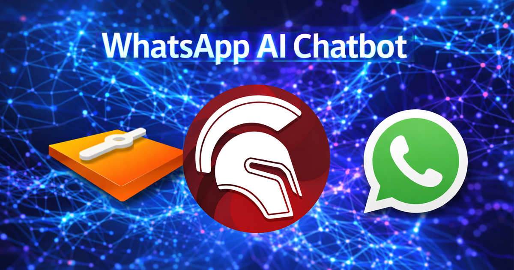

# WhatsApp AI Chatbot (Delphi + Clever Internet Suite)



## Overview

This project demonstrates how to build a minimal **WhatsApp AI Chatbot in Delphi** using:

* **WhatsApp Cloud API**
* **OpenAI Responses API**
* **Clever Internet Suite components**

Incoming WhatsApp messages are received via a webhook endpoint, processed using OpenAI, and replied to via the WhatsApp Cloud API.

The project is designed as a **learning and demonstration example** for Delphi developers using the Clever Internet Suite library.

---

## Architecture

```
WhatsApp (Meta)
        ↓
Webhook (TclHttpServer)
        ↓
OpenAI Responses API (TclHttp)
        ↓
WhatsApp Cloud API (TclHttp)
```

### Components Used

* `TclHttp` — HTTPS client
* `TclHttpRequest` — JSON request builder
* `TclJSONObject` — JSON build/parse
* `TclHttpServer` — HTTP/HTTPS webhook server

> `TclHttpServer` example repository:
> [https://github.com/CleverComponents/Http-Server](https://github.com/CleverComponents/Http-Server)

All components are part of the **Clever Internet Suite library**.

---

## Configuration

The application uses an INI file located next to the executable.

Example:

```ini
[Environment]
WHATSAPP_VERIFY_TOKEN=your_verify_token
WHATSAPP_ACCESS_TOKEN=your_whatsapp_token
WHATSAPP_PHONE_NUMBER_ID=your_phone_id
OPENAI_API_KEY=your_openai_key
PORT=5000
```

---

## How It Works

### 1. Webhook Verification (GET)

Meta sends:

```
/webhook?hub.mode=subscribe&hub.verify_token=XXX&hub.challenge=123
```

The server validates `hub.verify_token` and returns `hub.challenge`.

---

### 2. Message Handling (POST)

* Incoming JSON is parsed using `TclJSONObject`
* Extracted:

  * Sender number
  * Sender name
  * Message text
* HTTP 200 (`EVENT_RECEIVED`) is returned immediately
* Message processing continues in a background thread

---

### 3. OpenAI Integration

The project uses the **OpenAI Responses API**:

```
POST https://api.openai.com/v1/responses
```

A small system-style prompt is added before sending:

```
You're a kind assistant, say hello to the user.
Username:
'''
{user_name}
'''
User request:
'''
{user_input}
'''
```

No chat history is stored (simplified demo design).

---

### 4. WhatsApp Reply

The generated response is sent via:

```
POST https://graph.facebook.com/v21.0/{PHONE_NUMBER_ID}/messages
```

Only **text messages** are supported in this demo.

---

## Testing Notes

Due to Meta development restrictions:

* Test messages must be sent via Meta Developer Dashboard
* Only allowlisted numbers are supported

To simplify testing, a **Test Reply button** is included.
It allows sending a message to OpenAI and replying via WhatsApp without waiting for a webhook event.

---

## TLS Configuration

To ensure stable HTTPS communication with OpenAI, the following settings are used:

```pascal
Http.UseSystemTLSFlags := False;
Http.TLSFlags := [tfUseTLS12];
```

In some previous versions of the Clever Internet Suite library, automatic TLS negotiation (including TLS 1.3) could cause connection issues with certain servers. To avoid such problems and ensure predictable behavior, it is recommended to explicitly enable TLS 1.2.

### Production Deployment

The `TclHttpServer` component fully supports HTTPS (SSL/TLS).

If the application is deployed on a server with:

* A real domain name
* A valid SSL/TLS certificate

You can load the certificate directly into `TclHttpServer` and use secure HTTPS communication without tunneling via ngrok or other utilities.

A complete HTTPS configuration example (including certificate loading and binding) is available in the TclHttpServer demo project:
[https://github.com/CleverComponents/Http-Server/tree/master/demo](https://github.com/CleverComponents/Http-Server/tree/master/demo)

The demo shows how to import or create a certificate, assign it to the server, and enable secure SSL/TLS communication.

For local development, HTTP + ngrok tunneling is sufficient.

---

## Requirements

### Delphi Compatibility

Delphi XE7 and higher.

### Other Requirements

* Clever Internet Suite v10 or higher
* Valid OpenAI API key
* WhatsApp Cloud API credentials

---

## Educational Purpose

This is a **demonstration project**, not a production-ready chatbot.

It is intended to show:

* How to build a webhook server using `TclHttpServer`
* How to send JSON requests using `TclHttpRequest`
* How to integrate OpenAI Responses API in Delphi
* How to call WhatsApp Cloud API
* How to manage asynchronous processing safely

---

## Related Projects

* Delphi OpenAI GPT Chat:
  [https://github.com/CleverComponents/Clever-Internet-Suite-Tutorials/tree/master/vcl/OpenAI-GPT-Chat](https://github.com/CleverComponents/Clever-Internet-Suite-Tutorials/tree/master/vcl/OpenAI-GPT-Chat)
* Clever Internet Suite Tutorials repository:
  [https://github.com/CleverComponents/Clever-Internet-Suite-Tutorials](https://github.com/CleverComponents/Clever-Internet-Suite-Tutorials)

---

## Repository

The [GitHub/CleverComponents/Clever-Internet-Suite-Tutorials](https://github.com/CleverComponents/Clever-Internet-Suite-Tutorials) repository contains a collection of examples, code snippets, and demo projects for the [Clever Internet Suite Tutorials](https://www.clevercomponents.com/articles/article035/). It will be updated periodically with new projects.

Stay tuned for new examples and use cases of the [Clever Internet Suite](https://www.clevercomponents.com/products/inetsuite/) library.
